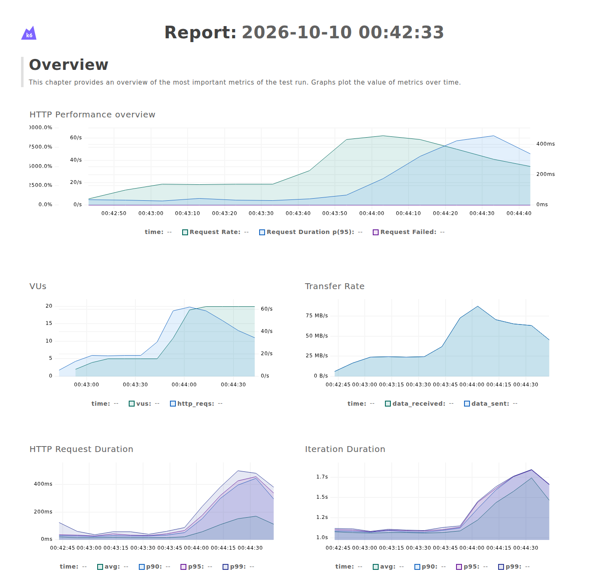

# Suivi de performance

Ce document présente le test de charge du parcours critique (upload puis téléchargement), son interprétation, les logs structurés et les métriques suivies côté serveur, ainsi que le budget de performance du front. Les choix d'outils sont justifiés dans la note « logs structurés et test de performance » de [docs/architecture.md](docs/architecture.md).

## Outils

| Besoin | Outil | Pourquoi |
|---|---|---|
| Test de charge | **k6** 2.3 (Grafana), dans son image Docker | Outil cité par les spécifications, scénarios en JavaScript, seuils (*thresholds*) qui font échouer le test, rapport HTML intégré ; rien à installer |
| Logs structurés | **pino** via `nestjs-pino` | Une ligne JSON par événement, une ligne par requête avec sa durée (`responseTime`), un identifiant de corrélation par requête ; le logger le plus rapide de l'écosystème Node |
| Métriques du process | `ps` et `/proc/<pid>/stat`, relevés chaque seconde par [scripts/perf.sh](scripts/perf.sh) | Mémoire (RSS) et CPU du back pendant le test, sans infrastructure de supervision |
| Analyse serveur | [scripts/perf-report.mjs](scripts/perf-report.mjs) | Percentiles des temps de réponse par route, événements métier et chronologie, calculés à partir des logs |
| Performance navigateur | **Lighthouse** 13.5, lancé ponctuellement avec `npx` | Référence pour les Core Web Vitals ; pas besoin d'en faire une dépendance |

## Test de charge du parcours critique

### Scénario

Le script [perf/upload-download.js](perf/upload-download.js) enchaîne, pour chaque utilisateur virtuel, les étapes d'un partage :

1. `POST /files` : téléversement d'un fichier de **5 Mo** (taille typique d'un document partagé), connecté ;
2. `GET /f/:token` : ouverture du lien (métadonnées) ;
3. `POST /f/:token/download` : téléchargement complet, avec vérification de la taille reçue ;
4. `DELETE /files/:id` : suppression, pour que l'espace disque reste constant pendant le test (et pour exercer US06) ;
5. 1 s de pause (temps de réflexion d'un utilisateur réel).

Profil de charge sur 2 min 10 s : montée à **5 utilisateurs simultanés** (charge nominale), palier de 40 s, puis montée à **20 utilisateurs** (quatre fois plus), palier de 40 s, puis descente.

k6 appelle directement le back (port 3001), sans passer par le proxy Vite, afin de mesurer l'API seule. Le back est démarré par le script avec la base de test, comme pour `npm run e2e` : les données de développement ne sont jamais touchées.

### Objectifs (fixés avant le test)

| Métrique | Seuil | Justification |
|---|---|---|
| Taux d'erreur HTTP | < 1 % | Un partage qui échoue est perdu pour l'utilisateur |
| Upload 5 Mo, p95 | < 2 s | Le traitement serveur doit rester négligeable devant le temps de transfert réel d'un utilisateur (5 Mo ≈ 4 s en fibre à 10 Mbit/s montant) |
| Téléchargement 5 Mo, p95 | < 1 s | Idem, dans le sens descendant |
| Métadonnées et suppression, p95 | < 300 ms | Requêtes sans fichier : réponse perçue comme immédiate |

### Environnement

Tout tourne sur un seul poste de développement : Ryzen 9 5950X (16 cœurs), 32 Go de RAM, WSL2, PostgreSQL 16 en conteneur, back compilé (`node dist/main`, un seul process Node 24). k6 tourne sur la même machine et partage donc le CPU et le disque avec le back. Le réseau est la boucle locale : le temps de transfert d'un vrai réseau n'est pas mesuré, seul le coût serveur l'est.

### Résultats (10/10/2026)



**Côté client (k6)** : 1 077 itérations, 4 309 requêtes, **0 % d'erreur**, 5 385 vérifications réussies sur 5 385, 5,6 Go envoyés et 5,6 Go reçus. **Tous les seuils sont respectés.**

| Requête | Médiane | p90 | p95 | p99 | Max | Seuil p95 |
|---|---|---|---|---|---|---|
| Upload 5 Mo | 98 ms | 416 ms | **447 ms** | 499 ms | 507 ms | < 2 s ✓ |
| Métadonnées | 5 ms | 20 ms | **23 ms** | 29 ms | 44 ms | < 300 ms ✓ |
| Téléchargement 5 Mo | 64 ms | 248 ms | **269 ms** | 288 ms | 408 ms | < 1 s ✓ |
| Suppression | 11 ms | 35 ms | **41 ms** | 50 ms | 75 ms | < 300 ms ✓ |

**Côté serveur (logs pino)** : les durées mesurées par le back (`responseTime`) sont très proches de celles de k6 (upload p95 431 ms contre 447 ms ; téléchargement 266 ms contre 269 ms). Le temps se passe donc bien dans le serveur, et non dans le client de test ou le réseau local.

| Route | Requêtes | Statuts | p50 | p95 | p99 | Max |
|---|---|---|---|---|---|---|
| `POST /files` | 1 077 | 201 × 1 077 | 95 ms | 431 ms | 478 ms | 505 ms |
| `GET /f/:token` | 1 077 | 200 × 1 077 | 3 ms | 13 ms | 19 ms | 39 ms |
| `POST /f/:token/download` | 1 077 | 200 × 1 077 | 62 ms | 266 ms | 285 ms | 388 ms |
| `DELETE /files/:id` | 1 077 | 204 × 1 077 | 9 ms | 31 ms | 42 ms | 73 ms |

**Chronologie** (tranches de 10 s, d'après les logs et les relevés du process) :

| Début (s) | Charge | Requêtes/s | Upload p95 | Téléchargement p95 | CPU du process | RSS max |
|---|---|---|---|---|---|---|
| 0 | montée vers 5 | 6,0 | 55 ms | 32 ms | 23 % | 164 Mo |
| 20 | 5 utilisateurs | 18,6 | 46 ms | 26 ms | 59 % | 169 Mo |
| 40 | 5 utilisateurs | 18,8 | 57 ms | 29 ms | 61 % | 172 Mo |
| 60 | montée vers 20 | 32,6 | 55 ms | 39 ms | 101 % | 183 Mo |
| 70 | montée vers 20 | 57,8 | 90 ms | 65 ms | 140 % | 182 Mo |
| 80 | 20 utilisateurs | 65,6 | 244 ms | 152 ms | 135 % | 228 Mo |
| 100 | 20 utilisateurs | 50,0 | 479 ms | 292 ms | 94 % | 237 Mo |
| 110 | 20 utilisateurs | 44,8 | 467 ms | 275 ms | 87 % | 242 Mo |

(100 % = un cœur entièrement occupé. Le process peut dépasser 100 % grâce aux threads de Node hors JavaScript : entrées-sorties disque, ramasse-miettes.)

### Interprétation

- **À charge nominale (5 utilisateurs), l'API est très à l'aise** : upload et téléchargement de 5 Mo sous 60 ms au p95, environ 60 % d'un cœur. Le temps de transfert réseau d'un utilisateur réel (plusieurs secondes pour 5 Mo) écrasera largement ce coût serveur.
- **À 20 utilisateurs, un seul process Node arrive à saturation.** Le débit ne suit plus la charge : il passe de 19 à 50-65 requêtes/s (×2,6 à ×3,5 pour ×4 d'utilisateurs). La latence est multipliée par 8 à 10 (upload p95 de ~50 ms à ~470 ms). Le CPU du process atteint et dépasse un cœur. C'est le comportement attendu d'une application Node : le code JavaScript (dont le découpage du flux *multipart* de l'upload par multer/busboy) s'exécute sur un seul thread, et les requêtes simultanées font la queue. Le disque, partagé avec k6 sur une machine WSL2, contribue probablement aussi : un profilage (`node --cpu-prof`) permettrait de faire la part des deux.
- **La dégradation est progressive et sans erreur** : aucune requête en échec et aucun délai dépassé, même saturée. L'API ralentit, mais elle ne casse pas.
- **La mémoire reste bornée.** Le RSS monte de 164 à ~240 Mo pendant la montée en charge, puis se stabilise sur le palier. Si les fichiers étaient chargés en mémoire, 20 uploads et téléchargements simultanés de 5 Mo ajouteraient jusqu'à 200 Mo à chaque vague, et le RSS suivrait le débit. Ce n'est pas le cas : la réception en flux vers le disque (multer `dest`) et l'envoi en flux (`StreamableFile`) fonctionnent comme prévu. C'est ce qui permet d'accepter des fichiers de 1 Go.
- **Les requêtes sans fichier restent rapides même à saturation** (métadonnées p95 23 ms, suppression 41 ms) : la base de données n'est pas le goulot d'étranglement.

### Pistes d'amélioration (non mises en œuvre, hors périmètre du MVP)

Par ordre de rapport gain/effort :

1. **Plusieurs process Node** derrière le reverse proxy (cluster Node, PM2 ou plusieurs conteneurs) : le back est sans état (JWT, fichiers sur disque partagé), le débit devrait donc croître avec le nombre de cœurs.
2. **Téléchargement servi par le reverse proxy** (`X-Accel-Redirect` de Nginx, ou `sendfile`) : Node vérifie les droits et le mot de passe, puis délègue l'envoi du fichier.
3. **Stockage objet avec URL présignées** (S3), prévu par l'abstraction `StorageService` : les octets ne transitent plus du tout par l'API.
4. **Limitation de débit par adresse IP**, qui sert aussi la sécurité (voir [SECURITY.md](SECURITY.md)).

## Logs structurés et métriques suivies

### Format

Le back écrit **une ligne JSON par événement** sur la sortie standard (le format attendu par Docker et par les outils de collecte : Loki, ELK, CloudWatch…). Chaque requête HTTP produit une ligne à sa fin, avec sa méthode, son URL, son statut, la taille des corps et sa durée en millisecondes. Les services ajoutent des **événements métier**. Toutes les lignes d'une même requête partagent son identifiant (`reqId`), également renvoyé au client dans l'en-tête `X-Request-Id` : un utilisateur qui signale une erreur peut donner cet identifiant, qui permet de retrouver toutes les lignes de sa requête.

Extrait réel du test de charge (un téléchargement) :

```json
{"level":30,"time":1791585753543,"reqId":"f8015b73-e5af-44db-8ac5-8c81bbd01c89","context":"FilesService","msg":"file downloaded","fileId":"991a95ec-06cf-4d15-86cc-6cec8128f86c","sizeBytes":5242880}
{"level":30,"time":1791585753566,"reqId":"f8015b73-e5af-44db-8ac5-8c81bbd01c89","req":{"id":"f8015b73-e5af-44db-8ac5-8c81bbd01c89","method":"POST","url":"/f/472e8b21…/download","contentLength":"2","userAgent":"Grafana k6/2.3.0","remoteAddress":"::ffff:127.0.0.1"},"res":{"statusCode":200,"contentLength":5242880},"responseTime":26,"msg":"request completed"}
```

Le token de téléchargement est tronqué à 8 caractères (`472e8b21…`) : c'est assez pour suivre un lien, mais beaucoup trop peu pour le deviner. L'en-tête `Authorization`, les cookies, le corps des requêtes (mots de passe) et les emails ne sont jamais journalisés (détail dans la note d'architecture).

| Événement | Niveau | Champs |
|---|---|---|
| `request completed` / `request errored` | `info` (2xx-3xx), `warn` (4xx), `error` (5xx) | `req` (méthode, URL, taille, user-agent, IP), `res` (statut, taille), `responseTime` |
| `file uploaded` | `info` | `fileId`, `sizeBytes`, `anonymous`, `passwordProtected`, `expiresInDays` |
| `file downloaded` | `info` | `fileId`, `sizeBytes` |
| `wrong file password` | `warn` | `fileId` (répété sur un même fichier : tentative de deviner le mot de passe) |
| `file deleted` | `info` | `fileId` |
| `account created` | `info` | `userId` |

Configuration : `LOG_LEVEL` (`info` par défaut, `silent` dans les tests) et `LOG_FORMAT=pretty` pour une sortie lisible en développement (voir `back/.env.example`). Le code est dans [back/src/logging/logger.config.ts](back/src/logging/logger.config.ts).

### Métriques clés et comment les obtenir

| Métrique | Pourquoi | Source |
|---|---|---|
| Temps de réponse par route (p50, p95, p99) | Le p95 reflète l'expérience des utilisateurs les moins bien servis, là où la moyenne la masque | champ `responseTime` des lignes de requête |
| Taux d'erreur (4xx, 5xx) | Un pic de 5xx est un incident ; un pic de 401 sur `/f/:token/download` peut signaler une attaque | `res.statusCode`, niveau `warn`/`error` |
| Taille des fichiers déposés et téléchargés | Volume de stockage et de bande passante, dimensionnement du disque | `sizeBytes` des événements `file uploaded` / `file downloaded` |
| Part d'uploads anonymes et protégés | Usage réel d'US07 et US09 | `anonymous`, `passwordProtected` |
| Mémoire et CPU du process | Détecter une fuite mémoire ou un fichier chargé en mémoire au lieu d'être lu en flux, et anticiper la saturation | relevés de `scripts/perf.sh` (en production : métriques du conteneur) |

Exemples d'analyse directe des logs avec `jq`, sans outil de supervision :

```bash
# p95 du temps de réponse de l'upload
jq -s '[.[] | select(.req.method == "POST" and .req.url == "/files") | .responseTime] | sort | .[(length * 0.95 | floor)]' back.log
# volume déposé, en Mo
jq -s '[.[] | select(.msg == "file uploaded") | .sizeBytes] | add / 1048576' back.log
# requêtes en erreur serveur
jq 'select(.res.statusCode >= 500)' back.log
```

En production, ces logs JSON sont prêts à être envoyés vers un outil de collecte. L'étape suivante serait d'exposer des métriques Prometheus (`/metrics`) avec un tableau de bord Grafana. Elle n'a pas été mise en place : ce serait disproportionné pour le MVP.

## Budget de performance côté front

Les spécifications demandent un budget de performance pour le front (bundle et navigateur), le test de charge couvrant déjà le back.

### Bundle

Mesuré avec `npm run build -w front` (Vite 8, build de production, minifié) :

| Ressource | Taille | Gzip | Budget (gzip) | État |
|---|---|---|---|---|
| JavaScript (un seul fichier) | 277 Ko | **87,6 Ko** | ≤ 150 Ko | ✓ |
| CSS | 6,9 Ko | **1,9 Ko** | ≤ 20 Ko | ✓ |
| HTML | 0,7 Ko | 0,4 Ko | — | ✓ |

Le JavaScript est essentiellement composé de React, React DOM et React Router. Le budget de 150 Ko laisse de la marge pour les fonctionnalités à venir. S'il était dépassé, la première mesure serait de découper le bundle par route (`React.lazy`), pour que la page de téléchargement publique (`/f/:token`), la plus visitée, ne charge pas le code de l'espace personnel.

### Navigateur (Lighthouse)

Build de production servi par `vite preview`, Lighthouse 13.5 en profil **mobile** (réseau 4G lente et CPU ralenti, simulés) :

| Page | Performance | Accessibilité | Bonnes pratiques | FCP | LCP | TBT | CLS |
|---|---|---|---|---|---|---|---|
| Accueil (upload) | **94** | 100 | 100 | 2,5 s | 2,5 s | 0 ms | 0,001 |
| Connexion | **94** | 92 | 100 | 2,4 s | 2,4 s | 0 ms | 0 |

| Indicateur | Budget | État |
|---|---|---|
| Score Performance (mobile) | ≥ 90 | ✓ 94 |
| LCP (*Largest Contentful Paint*) | ≤ 2,5 s (seuil « bon » des Core Web Vitals) | ✓ 2,4-2,5 s, à la limite |
| TBT (*Total Blocking Time*) | ≤ 200 ms | ✓ 0 ms |
| CLS (*Cumulative Layout Shift*) | ≤ 0,1 | ✓ ~0 |
| Poids total de la page | ≤ 500 Ko | ✓ 126 Ko |

Interprétation : la page ne bloque jamais le thread principal (TBT 0 ms) et ne bouge pas pendant le chargement (CLS ~0). Le LCP de 2,5 s en 4G lente simulée tient au téléchargement du bundle unique de 88 Ko, qui doit arriver avant le premier affichage d'une application React rendue côté client. Il est à la limite du budget : c'est l'indicateur à surveiller. Le découpage par route cité plus haut serait la première mesure en cas de dépassement. En profil **desktop** (sans bridage), l'accueil obtient 100 en performance, avec un FCP et un LCP de 0,7 s.

Lighthouse relève aussi un **contraste insuffisant** sur la page de connexion (lien « Créer un compte » et bouton principal, couleurs des maquettes). Le point est noté pour être corrigé avec la charte graphique.

## Reproduire les mesures

```bash
# test de charge (PostgreSQL démarré : docker compose up -d), depuis la racine, ~2 min 30
npm run perf
# résultats dans perf/results/ (ignoré par git) :
#   report.html       rapport graphique de k6
#   summary.json      métriques k6 (percentiles, seuils)
#   back.log          logs JSON du back pendant le test
#   process.csv       mémoire et CPU du back, chaque seconde
#   server-report.md  analyse côté serveur (percentiles par route, événements, chronologie)

# même scénario avec une autre taille de fichier (en Mo, 5 par défaut)
FILE_SIZE_MB=20 npm run perf

# budget du front
npm run build -w front
(cd front && npx vite preview --port 4173 &)
# depuis un dossier temporaire : sous WSL, Lighthouse crée son profil Chrome dans le dossier courant
cd "$(mktemp -d)" && CHROME_PATH=$(which google-chrome) npx lighthouse@13.5.0 https://localhost:4173/ \
  --chrome-flags="--headless=new --ignore-certificate-errors" --view   # ajouter --preset=desktop pour le profil desktop
```

La commande échoue si un seuil de k6 est dépassé : un résultat se lit donc d'abord au code de sortie, puis dans les rapports.
