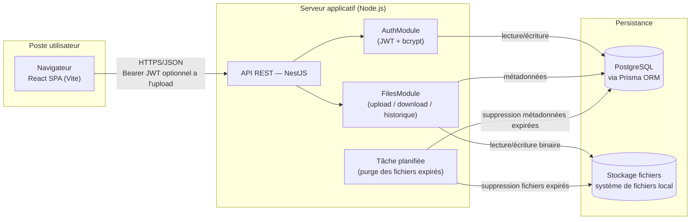

# Architecture de l'application

## Schéma d'architecture

### Légende

- **Navigateur (React SPA)** : consomme l'API REST en JSON, conserve le token JWT côté client et l'envoie dans l'en-tête `Authorization: Bearer <token>` pour les routes protégées. L'écran d'upload des maquettes ne force pas la connexion : le token est transmis s'il existe, sinon la requête part en anonyme.
- **API REST (NestJS)** : point d'entrée unique, découpée en modules `AuthModule` (inscription/connexion) et `FilesModule` (upload, téléchargement, historique, suppression, tags). La route d'upload utilise un guard d'authentification **optionnelle** (`OptionalJwtAuthGuard`) : si un token valide est fourni, le fichier est rattaché à l'utilisateur (US01, avec historique et tags) ; sinon l'upload est traité en anonyme (US07, pas d'historique, pas de tags).
- **Tâche planifiée (cron)** : exécutée quotidiennement dans le processus NestJS (`@nestjs/schedule`), purge les fichiers dont `expires_at` est dépassé — à la fois en base et sur le disque.
- **PostgreSQL** : source de vérité pour les utilisateurs et les métadonnées des fichiers (nom, taille, date d'expiration, token de lien, mot de passe hashé).
- **Stockage local** : le contenu binaire des fichiers est écrit sur disque, référencé en base par un chemin (`storage_path`). Le service d'accès au stockage est isolé derrière une interface (`StorageService`) pour permettre de basculer vers S3 sans impacter le reste de l'application si le besoin apparaît après le MVP.

### Flux d'échange sécurisé

- Toutes les communications client/serveur transitent en HTTPS.
- Les mots de passe utilisateurs et les mots de passe de protection de fichier sont hashés (bcrypt) avant stockage, jamais en clair.
- Le lien de téléchargement s'appuie sur un token non prédictible (UUID) et non sur l'identifiant incrémental du fichier.
- Les fichiers exécutables ou scripts sont refusés à l'upload (contrôle serveur sur l'extension du nom d'origine : `.exe`, `.bat`, `.cmd`, `.com`, `.msi`, `.scr`, `.ps1`, `.vbs`, `.sh`, `.jar`), la liste étant laissée « à définir selon la politique de sécurité » par les spécifications (US01).

### Environnement de développement

PostgreSQL est fourni à l'équipe sous forme de conteneur Docker, démarré via un fichier `docker-compose.yml` versionné à la racine du dépôt. Chaque développeur lance `docker compose up -d` pour obtenir une base identique (même version de PostgreSQL, mêmes identifiants, port exposé identique), sans installation locale de PostgreSQL ni divergence de configuration entre les postes. L'API NestJS (lancée en local via `npm run start:dev` pour profiter du rechargement à chaud) se connecte à cette base via une URL de connexion définie dans `.env`. Ce même fichier `docker-compose.yml` sert de base au script de déploiement (cahier des charges), garantissant que l'environnement de démonstration reproduit fidèlement l'environnement de développement.

## Choix technologiques justifiés

### Tableau de synthèse

| Élément | Technologie choisie | Alternatives envisagées | Justification |
|---|---|---|---|
| Langage | TypeScript (front et back) | Java, C#, PHP | Un seul langage sur toute la stack réduit le contexte-switching pour un développeur seul sur 4 semaines, et le typage statique limite les bugs d'intégration front/back sur le contrat d'API |
| Back-end | NestJS | Spring Boot, .NET Core, Symfony/Laravel | Architecture modulaire proche de Spring (modules, providers, guards, pipes) mais avec un délai de mise en route bien plus court ; support natif de la validation (`class-validator`), de l'upload (`multer`) et des tâches planifiées (`@nestjs/schedule`) nécessaires au MVP |
| Front-end | React (Vite) | Angular, VueJS | Écosystème le plus large pour trouver rapidement des solutions aux besoins ponctuels (formulaires, routing, appels API) ; Vite offre un démarrage et un rechargement à chaud quasi instantanés, utile en rythme de développement rapide |
| Base de données | PostgreSQL | MongoDB | Les données du MVP sont fortement relationnelles (un utilisateur possède des fichiers, contraintes d'unicité sur l'email et le token de lien) ; un moteur relationnel avec contraintes natives (`UNIQUE`, `FOREIGN KEY`) évite de réimplémenter ces garanties au niveau applicatif |
| ORM | Prisma | TypeORM, Sequelize | Schéma déclaratif unique (`schema.prisma`) qui sert à la fois de source de vérité pour les migrations et de documentation du modèle de données, cohérent avec le MCD |
| Authentification | JWT (Bearer) + bcrypt, via Passport.js | Sessions serveur, OAuth2 | Stateless (pas de session à stocker côté serveur, aligné avec un déploiement simple), standard bien supporté par NestJS (`@nestjs/passport`, `@nestjs/jwt`), suffisant pour le périmètre du MVP (pas de SSO requis) |
| Stockage des fichiers | Système de fichiers local | AWS S3 | Élimine toute dépendance et tout coût cloud pour un prototype démontré en local/sur un seul serveur ; l'accès est isolé derrière une interface `StorageService` pour permettre une migration vers S3 sans réécrire la logique métier si le produit doit scaler après la levée de fonds |
| Hébergement / déploiement | Docker Compose (API + PostgreSQL) | Hébergement PaaS (Render, Railway) | Reproductible en local pour la démonstration aux investisseurs sans dépendre d'un compte cloud externe ; correspond à l'exigence de scripts de déploiement (installation + configuration BDD) du cahier des charges |
| Base de données en développement | PostgreSQL en conteneur Docker (via Compose) | Installation PostgreSQL locale par poste | Un seul `docker compose up` donne à toute l'équipe la même version et la même configuration de base, sans divergence entre les machines ni pollution de l'OS hôte ; le même fichier Compose sert au déploiement |
| Tests | Vitest (unitaire, front et back) + React Testing Library (composants front) + Supertest (API) + Cypress (e2e) | Jest, Playwright | Vitest est désormais le choix par défaut du CLI Nest comme de Vite (partagé front/back), avec un démarrage et un mode watch nettement plus rapides que Jest ; React Testing Library teste les composants React tels que l'utilisateur les manipule ; Cypress est l'outil cité par les spécifications (« Cypress ou équivalent ») pour les scénarios e2e. Seuil de couverture visé : 70 % (spécifications, `TESTING.md`) |
| Tests de performance | k6 | Artillery, JMeter | Outil cité par les spécifications pour le test de charge d'un endpoint critique (`PERF.md`) ; scénarios écrits en JavaScript, cohérent avec le reste de la stack |
| Qualité / CI | GitHub Actions, oxlint, Prettier | ESLint, GitLab CI | oxlint (écrit en Rust) remplace ESLint par défaut dans les derniers CLI Nest et Vite, avec un temps d'exécution très inférieur ; le dépôt est hébergé sur GitHub, Actions permet de lancer lint + tests + `npm audit` à chaque push sans infrastructure supplémentaire |
| Gestion de version | Git + convention "Conventional Commits" | — | Exigé par le cahier des charges (historique Git propre) et facilite la génération d'un changelog pour `MAINTENANCE.md` |
| IDE / outillage | VS Code, oxlint, Prettier, npm | JetBrains WebStorm, ESLint, Yarn/pnpm | Outillage standard de l'écosystème Node.js/TypeScript, gratuit et largement documenté ; oxlint aligné sur l'état de l'art actuel des générateurs de projet (Nest CLI, Vite) |

### Détail des arbitrages principaux

**Langage et frameworks.** Le choix d'un stack 100 % TypeScript (NestJS + React) est dicté par la contrainte de délai : un seul développeur doit livrer un MVP complet (auth, upload, téléchargement, historique) en 4 semaines. Unifier le langage entre front et back permet de partager des types (DTO d'API) et de réduire le temps perdu à basculer entre écosystèmes. NestJS a été préféré à Express brut pour sa structure imposée (modules, injection de dépendances, guards) qui facilite la lisibilité du code pour une revue ultérieure par l'équipe DataShare, tout en restant beaucoup plus rapide à mettre en œuvre que Spring Boot ou .NET Core pour un projet de cette taille.

> **Note — pourquoi pas Next.js ?** Un framework full-stack avec SSR (type Next.js) a été écarté, pour deux raisons tenant aux spécifications elles-mêmes (`docs/P3+EDO+P4+AL+-+Spécifications+pour+l’application.pdf`, section « Stack technique (à choisir) ») et non à une préférence d'implémentation :
> 1. Le cahier des charges impose deux choix **distincts et fermés** : back-end parmi {Spring Boot, .NET Core, NestJS, Symfony/Laravel} et front-end parmi {Angular, React, VueJS}. Next.js ne figure dans aucune des deux listes puisqu'il fusionne les deux rôles — ce n'est donc pas une option technique valide au sens des spécifications.
> 2. La section « Meilleures pratiques à suivre » exige explicitement une « Architecture REST API », ce qui suppose un back-end découplé exposant un contrat d'interface (cf. `docs/api-contract.yaml`) consommé par un client séparé — pas des routes/API handlers intégrés au même projet que le rendu des pages.
>
> Par ailleurs, le SSR n'apporterait que peu de valeur ici : DataShare est un espace applicatif derrière authentification (upload, historique, téléchargement par lien), pas un site de contenu où le SEO ou le temps de premier affichage sur des pages publiques sont déterminants.

> **Note — pourquoi pas Redux / Redux Toolkit ?** Aucune librairie de state management global n'est utilisée côté front ; le cahier des charges n'impose d'ailleurs que le choix du framework (React), pas d'outil de gestion d'état. La quasi-totalité de ce qui serait un « état global » dans une autre application est ici de l'**état serveur** (liste des fichiers de l'historique, métadonnées d'un fichier avant téléchargement) : chaque écran va le chercher via l'API au moment où il en a besoin, plutôt que de le dupliquer dans un store client. Le seul état réellement partagé entre composants est le token JWT de l'utilisateur connecté, trop simple pour justifier un store Redux dédié — un Context React suffit. Redux/RTK apporterait une structure plus prévisible et des devtools utiles si l'application grossissait fortement (beaucoup d'écrans consommant les mêmes données en parallèle), mais ce n'est pas le profil d'un MVP solo en 4 semaines avec un nombre d'écrans limité (login, upload, historique, téléchargement).

> **Note — composants graphiques réutilisables.** Les maquettes (`docs/maquette/`) reposent sur un nombre restreint de briques visuelles qui se répètent d'un écran à l'autre (boutons, champs de saisie, cartes, bandeaux d'information, en-tête). Plutôt que de dupliquer ces éléments dans chaque page, ils sont regroupés dans un dossier `src/components/ui/` côté front, selon une règle simple appliquée au fil des développements : **un élément devient un composant réutilisable uniquement lorsqu'il est nécessaire à au moins deux écrans**. Un élément propre à un seul écran reste défini localement dans cet écran ; il n'est extrait en composant partagé qu'au moment où un second usage apparaît réellement, et pas par anticipation.
>
> Au vu des maquettes, les composants partagés attendus sont les suivants :
>
> | Composant | Écrans concernés | Variantes / états couverts |
> |---|---|---|
> | `Button` | Tous (Connexion, Créer mon compte, Téléverser, Télécharger, Copier le lien, Supprimer, Accéder, Se connecter / Mon espace) | Plein, contour, lien, sombre ; actif / désactivé ; icône optionnelle |
> | `Input` (label + champ) | Connexion, inscription, upload (mot de passe optionnel), téléchargement (mot de passe) | Texte, email, mot de passe ; message d'erreur de validation |
> | `Callout` | Téléchargement (fichier bientôt expiré, expiré), upload (erreur de taille) | Information, avertissement, erreur |
> | `Card` (carte blanche avec titre) | Connexion, Créer un compte, Ajouter un fichier, Télécharger un fichier | — |
> | `Header` | Tous les écrans publics | Action « Se connecter » (anonyme) ou « Mon espace » (connecté) ; mobile / desktop |
> | `PublicLayout` (fond dégradé + en-tête + pied de page) | Accueil, Connexion, Créer un compte, Téléversement, Téléchargement | — |
> | `FileInfo` (icône + nom tronqué + taille ou expiration) | Ajout de fichier, téléchargement, historique « Mes fichiers » | Taille, date d'expiration, état expiré |
>
> À l'inverse, les éléments suivants n'apparaissent que sur un seul écran et ne font **pas** l'objet d'un composant générique : la liste déroulante d'expiration (un `<select>` natif stylé suffit), le filtre « Tous / Actifs / Expiré » et la mise en page avec barre latérale de « Mes fichiers », ainsi que le bouton rond d'upload de l'accueil. Ils peuvent être placés dans leur propre fichier pour la lisibilité et les tests, mais sans chercher à les rendre paramétrables au-delà de leur unique usage.
>
> Ce choix reste volontairement léger : pas de librairie de composants externe (MUI, shadcn/ui…), pas de package partagé dédié ni de Storybook, qui représenteraient un coût de mise en place et de maintenance disproportionné pour un MVP de quatre écrans développé seul en 4 semaines. Les composants partagés n'exposent que les variantes effectivement présentes dans les maquettes. En contrepartie, ils constituent une cible privilégiée pour les tests unitaires front (Vitest + React Testing Library) : par exemple, vérifier qu'un `Button` désactivé ne déclenche pas d'action ou qu'un `Callout` affiche l'icône correspondant à sa variante. Un défaut corrigé dans un composant partagé est ainsi corrigé sur tous les écrans qui l'utilisent.

**Base de données.** Le modèle de données (cf. `docs/mcd.md`, MVP + fonctionnalités avancées) reste composé d'entités liées par des relations simples et des contraintes d'unicité fortes (email, token de téléchargement, couple fichier/tag). PostgreSQL apporte ces garanties nativement et reste largement suffisant en performance pour un prototype ; MongoDB n'apporterait pas de bénéfice ici puisqu'il n'y a pas de besoin de schéma flexible ou de volumétrie massive.

> **Note — cycle de vie d'un fichier expiré.** Les spécifications posent deux exigences à concilier : le fichier et ses métadonnées sont supprimés à expiration (US01, US10 — « une tâche planifiée purge les fichiers expirés chaque jour »), mais l'historique affiche « l'état du lien (valide ou expiré) » (US05) et un lien expiré doit renvoyer « une erreur explicite » (US02). La purge étant quotidienne, un fichier passe donc par trois états :
> 1. **Actif** (`expires_at` dans le futur) : téléchargeable, visible dans l'historique.
> 2. **Expiré, pas encore purgé** (`expires_at` dépassé, avant le passage du cron) : le téléchargement est refusé par un contrôle applicatif sur `expires_at` (réponse `410 Gone`, distincte du `404` d'un lien inconnu, pour l'écran « fichier expiré » des maquettes) ; le fichier reste visible dans l'historique avec le statut `expired`.
> 3. **Purgé** : métadonnées et binaire supprimés, le lien renvoie `404`.
>
> L'expiration n'attend donc jamais le cron : celui-ci ne fait que libérer l'espace. Conformément à US06 (« seuls les fichiers non expirés sont affichés par défaut dans l'historique »), `GET /files` ne renvoie par défaut que les fichiers actifs ; le filtre « Tous / Actifs / Expiré » des maquettes s'appuie sur le paramètre `status` (cf. `docs/api-contract.yaml`).

**Stockage des fichiers.** Le choix du système de fichiers local plutôt que S3 est un arbitrage explicite de simplicité pour le MVP : il évite la gestion de credentials AWS et de coûts variables pendant la phase de prototypage, tout en démontrant aux investisseurs une architecture pensée pour évoluer (interface `StorageService` remplaçable).

**Sécurité.** JWT + bcrypt couvrent les exigences de sécurité du cahier des charges (authentification, mots de passe hashés) sans complexité additionnelle d'un serveur d'autorisation OAuth2, non nécessaire pour un MVP mono-application sans intégration tierce.

**Environnement de développement.** Faire tourner PostgreSQL dans un conteneur Docker plutôt que de demander à chaque développeur de l'installer en local supprime les écarts de version et de configuration entre les postes (source classique de bugs « ça marche chez moi »). Cela permet aussi de repartir d'une base propre en une commande (`docker compose down -v && docker compose up -d`), ce qui est précieux en phase de prototypage où le schéma évolue vite.

**Tests et lint.** Les générateurs de projet officiels (Nest CLI et `create-vite`) proposent désormais Vitest et oxlint par défaut, en remplacement de Jest et ESLint historiquement recommandés. Ce projet suit cet état de l'art : Vitest s'intègre nativement à Vite côté front (pas de configuration Babel/ts-jest additionnelle) et partage la même API côté back, tandis qu'oxlint (implémenté en Rust) réduit fortement le temps de lint par rapport à ESLint, sans nécessiter de configuration manuelle pour démarrer.
