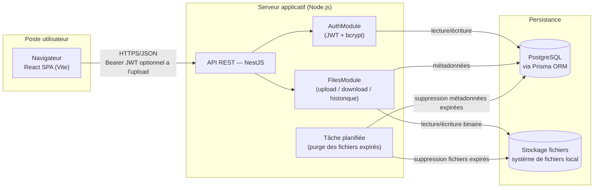

# Architecture de l'application

## Schéma d'architecture

### Légende

- **Navigateur (React SPA)** : consomme l'API REST en JSON, conserve le token JWT côté client et l'envoie dans l'en-tête `Authorization: Bearer <token>` pour les routes protégées. L'écran d'upload des maquettes ne force pas la connexion : le token est transmis s'il existe, sinon la requête part en anonyme.
- **API REST (NestJS)** : point d'entrée unique, découpée en modules `AuthModule` (inscription/connexion) et `FilesModule` (upload, téléchargement, historique, suppression, tags). La route d'upload utilise un guard d'authentification **optionnelle** (`OptionalJwtAuthGuard`) : si un token valide est fourni, le fichier est rattaché à l'utilisateur (US01, avec historique et tags) ; sinon l'upload est traité en anonyme (US07, pas d'historique, pas de tags).
- **Tâche planifiée (cron)** : exécutée quotidiennement dans le processus NestJS (`@nestjs/schedule`), purge les fichiers dont `expires_at` est dépassé — à la fois en base et sur le disque.
- **PostgreSQL** : source de vérité pour les utilisateurs et les métadonnées des fichiers (nom, taille, date d'expiration, token de lien, mot de passe hashé).
- **Stockage local** : le contenu binaire des fichiers est écrit sur disque, référencé en base par un chemin (`storage_path`). Le service d'accès au stockage est isolé derrière une interface (`StorageService`) pour permettre de basculer vers S3 sans impacter le reste de l'application si le besoin apparaît après le MVP.

### Flux d'échange sécurisé

- Toutes les communications client/serveur transitent en HTTPS.
- Les mots de passe utilisateurs et les mots de passe de protection de fichier sont hashés (bcrypt) avant stockage, jamais en clair.
- Le lien de téléchargement s'appuie sur un token non prédictible (UUID) et non sur l'identifiant incrémental du fichier.

### Environnement de développement

PostgreSQL est fourni à l'équipe sous forme de conteneur Docker, démarré via un fichier `docker-compose.yml` versionné à la racine du dépôt. Chaque développeur lance `docker compose up -d` pour obtenir une base identique (même version de PostgreSQL, mêmes identifiants, port exposé identique), sans installation locale de PostgreSQL ni divergence de configuration entre les postes. L'API NestJS (lancée en local via `npm run start:dev` pour profiter du rechargement à chaud) se connecte à cette base via une URL de connexion définie dans `.env`. Ce même fichier `docker-compose.yml` sert de base au script de déploiement (cahier des charges), garantissant que l'environnement de démonstration reproduit fidèlement l'environnement de développement.

## Choix technologiques justifiés

### Tableau de synthèse

| Élément | Technologie choisie | Alternatives envisagées | Justification |
|---|---|---|---|
| Langage | TypeScript (front et back) | Java, C#, PHP | Un seul langage sur toute la stack réduit le contexte-switching pour un développeur seul sur 4 semaines, et le typage statique limite les bugs d'intégration front/back sur le contrat d'API |
| Back-end | NestJS | Spring Boot, .NET Core, Symfony/Laravel | Architecture modulaire proche de Spring (modules, providers, guards, pipes) mais avec un délai de mise en route bien plus court ; support natif de la validation (`class-validator`), de l'upload (`multer`) et des tâches planifiées (`@nestjs/schedule`) nécessaires au MVP |
| Front-end | React (Vite) | Angular, VueJS | Écosystème le plus large pour trouver rapidement des solutions aux besoins ponctuels (formulaires, routing, appels API) ; Vite offre un démarrage et un rechargement à chaud quasi instantanés, utile en rythme de développement rapide |
| Base de données | PostgreSQL | MongoDB | Les données du MVP sont fortement relationnelles (un utilisateur possède des fichiers, contraintes d'unicité sur l'email et le token de lien) ; un moteur relationnel avec contraintes natives (`UNIQUE`, `FOREIGN KEY`) évite de réimplémenter ces garanties au niveau applicatif |
| ORM | Prisma | TypeORM, Sequelize | Schéma déclaratif unique (`schema.prisma`) qui sert à la fois de source de vérité pour les migrations et de documentation du modèle de données, cohérent avec le MCD |
| Authentification | JWT (Bearer) + bcrypt, via Passport.js | Sessions serveur, OAuth2 | Stateless (pas de session à stocker côté serveur, aligné avec un déploiement simple), standard bien supporté par NestJS (`@nestjs/passport`, `@nestjs/jwt`), suffisant pour le périmètre du MVP (pas de SSO requis) |
| Stockage des fichiers | Système de fichiers local | AWS S3 | Élimine toute dépendance et tout coût cloud pour un prototype démontré en local/sur un seul serveur ; l'accès est isolé derrière une interface `StorageService` pour permettre une migration vers S3 sans réécrire la logique métier si le produit doit scaler après la levée de fonds |
| Hébergement / déploiement | Docker Compose (API + PostgreSQL) | Hébergement PaaS (Render, Railway) | Reproductible en local pour la démonstration aux investisseurs sans dépendre d'un compte cloud externe ; correspond à l'exigence de scripts de déploiement (installation + configuration BDD) du cahier des charges |
| Base de données en développement | PostgreSQL en conteneur Docker (via Compose) | Installation PostgreSQL locale par poste | Un seul `docker compose up` donne à toute l'équipe la même version et la même configuration de base, sans divergence entre les machines ni pollution de l'OS hôte ; le même fichier Compose sert au déploiement |
| Tests | Jest (unitaire, front et back) + Supertest (API) + Cypress (e2e) | Vitest, Playwright | Jest est le standard par défaut de NestJS et de Create React App/Vite, ce qui évite une configuration supplémentaire ; Cypress est explicitement recommandé dans les spécifications pour les scénarios e2e |
| Qualité / CI | GitHub Actions, ESLint, Prettier | GitLab CI | Le dépôt est hébergé sur GitHub ; Actions permet de lancer lint + tests + `npm audit` à chaque push sans infrastructure supplémentaire |
| Gestion de version | Git + convention "Conventional Commits" | — | Exigé par le cahier des charges (historique Git propre) et facilite la génération d'un changelog pour `MAINTENANCE.md` |
| IDE / outillage | VS Code, ESLint, Prettier, npm | JetBrains WebStorm, Yarn/pnpm | Outillage standard de l'écosystème Node.js/TypeScript, gratuit et largement documenté |

### Détail des arbitrages principaux

**Langage et frameworks.** Le choix d'un stack 100 % TypeScript (NestJS + React) est dicté par la contrainte de délai : un seul développeur doit livrer un MVP complet (auth, upload, téléchargement, historique) en 4 semaines. Unifier le langage entre front et back permet de partager des types (DTO d'API) et de réduire le temps perdu à basculer entre écosystèmes. NestJS a été préféré à Express brut pour sa structure imposée (modules, injection de dépendances, guards) qui facilite la lisibilité du code pour une revue ultérieure par l'équipe DataShare, tout en restant beaucoup plus rapide à mettre en œuvre que Spring Boot ou .NET Core pour un projet de cette taille.

**Base de données.** Le modèle de données (cf. `docs/mcd.md`, MVP + fonctionnalités avancées) reste composé d'entités liées par des relations simples et des contraintes d'unicité fortes (email, token de téléchargement, couple fichier/tag). PostgreSQL apporte ces garanties nativement et reste largement suffisant en performance pour un prototype ; MongoDB n'apporterait pas de bénéfice ici puisqu'il n'y a pas de besoin de schéma flexible ou de volumétrie massive.

**Stockage des fichiers.** Le choix du système de fichiers local plutôt que S3 est un arbitrage explicite de simplicité pour le MVP : il évite la gestion de credentials AWS et de coûts variables pendant la phase de prototypage, tout en démontrant aux investisseurs une architecture pensée pour évoluer (interface `StorageService` remplaçable).

**Sécurité.** JWT + bcrypt couvrent les exigences de sécurité du cahier des charges (authentification, mots de passe hashés) sans complexité additionnelle d'un serveur d'autorisation OAuth2, non nécessaire pour un MVP mono-application sans intégration tierce.

**Environnement de développement.** Faire tourner PostgreSQL dans un conteneur Docker plutôt que de demander à chaque développeur de l'installer en local supprime les écarts de version et de configuration entre les postes (source classique de bugs « ça marche chez moi »). Cela permet aussi de repartir d'une base propre en une commande (`docker compose down -v && docker compose up -d`), ce qui est précieux en phase de prototypage où le schéma évolue vite.
