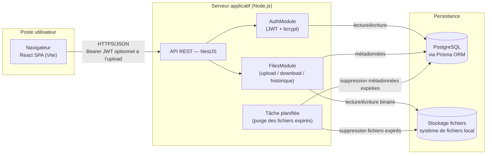

# Architecture de l'application

## Schéma d'architecture

### Légende

- **Navigateur (React SPA)** : consomme l'API REST en JSON, conserve le token JWT côté client et l'envoie dans l'en-tête `Authorization: Bearer <token>` pour les routes protégées. L'écran d'upload des maquettes ne force pas la connexion : le token est transmis s'il existe, sinon la requête part en anonyme.
- **API REST (NestJS)** : point d'entrée unique, découpée en modules `AuthModule` (inscription/connexion) et `FilesModule` (upload, téléchargement, historique, suppression, tags). La route d'upload utilise un guard d'authentification **optionnelle** (`OptionalJwtAuthGuard`) : si un token valide est fourni, le fichier est rattaché à l'utilisateur (US01, avec historique et tags) ; sinon l'upload est traité en anonyme (US07, pas d'historique, pas de tags).
- **Tâche planifiée (cron)** : exécutée quotidiennement dans le processus NestJS (`@nestjs/schedule`), purge les fichiers dont `expires_at` est dépassé — à la fois en base et sur le disque.
- **PostgreSQL** : source de vérité pour les utilisateurs et les métadonnées des fichiers (nom, taille, date d'expiration, token de lien, mot de passe hashé).
- **Stockage local** : le contenu binaire des fichiers est écrit sur disque, référencé en base par un chemin (`storage_path`). Le service d'accès au stockage est isolé derrière une interface (`StorageService`) pour permettre de basculer vers S3 sans impacter le reste de l'application si le besoin apparaît après le MVP.

### Flux d'échange sécurisé

- Toutes les communications entre le navigateur et le serveur transitent en HTTPS, en développement comme en production. Le navigateur ne s'adresse qu'à une seule origine, qui sert le front et transmet les appels préfixés par `/api` à l'API NestJS. En production, ce rôle revient à un reverse proxy placé devant l'API et le front, dans la configuration de déploiement (à venir). En développement, c'est le serveur Vite qui le joue (cf. note ci-dessous).

> **Note — HTTPS en développement.** Les spécifications ne mentionnent pas HTTPS : elles demandent seulement que le mot de passe soit stocké « de manière sécurisée (hashé, salé) » (US03) et que `SECURITY.md` présente une « analyse succincte des décisions » de sécurité. Le passage en HTTPS dès le développement est donc un choix, fait pour que l'environnement de développement reproduise le schéma de production plutôt que de le découvrir au déploiement :
> - **Serveur Vite en HTTPS** avec un certificat auto-signé (`@vitejs/plugin-basic-ssl`), généré au premier démarrage. Le navigateur demande une fois d'accepter le certificat ; la session de debug Chrome de VS Code l'accepte d'office (`--ignore-certificate-errors`, réservé à ce navigateur de debug). Un certificat signé par une autorité locale (mkcert) éviterait l'avertissement, mais demande de l'installer côté Windows, puisque le navigateur tourne hors de WSL : complexité jugée disproportionnée pour le MVP.
> - **API derrière un proxy, sur la même origine.** Le front appelle `/api/...` ; le serveur Vite retire le préfixe et transmet à NestJS, qui reste en HTTP sur le port 3000. Le chiffrement s'arrête donc au proxy, comme il s'arrêtera au reverse proxy en production, et l'API n'a pas à gérer de certificat. Le front et l'API partageant la même origine, la configuration CORS de l'API a été supprimée.
> - **Ce que ça ne change pas.** Le token JWT circule dans l'en-tête `Authorization` et non dans un cookie : aucun attribut `Secure` n'est à prévoir. Le serveur Node de Vite garde son délai maximal de requête par défaut (5 minutes) : sur `localhost`, un upload de 1 Go se termine bien avant.
- Les mots de passe utilisateurs et les mots de passe de protection de fichier sont hashés (bcrypt) avant stockage, jamais en clair.
- Le lien de téléchargement s'appuie sur un token non prédictible (UUID) et non sur l'identifiant incrémental du fichier.
- Les fichiers exécutables ou scripts sont refusés à l'upload (contrôle serveur sur l'extension du nom d'origine : `.exe`, `.bat`, `.cmd`, `.com`, `.msi`, `.scr`, `.ps1`, `.vbs`, `.sh`, `.jar`), la liste étant laissée « à définir selon la politique de sécurité » par les spécifications (US01).

### Environnement de développement

PostgreSQL est fourni à l'équipe sous forme de conteneur Docker, démarré via un fichier `docker-compose.yml` versionné à la racine du dépôt. Chaque développeur lance `docker compose up -d` pour obtenir une base identique (même version de PostgreSQL, mêmes identifiants, port exposé identique), sans installation locale de PostgreSQL ni divergence de configuration entre les postes. L'API NestJS (lancée en local via `npm run start:dev` pour profiter du rechargement à chaud) se connecte à cette base via une URL de connexion définie dans `.env`. Le code des trois packages (back, front et package partagé `shared_lib`) s'installe en une seule commande, `npm install` à la racine du dépôt (npm workspaces, cf. note sur le package partagé). Ce même fichier `docker-compose.yml` servira de base au script de déploiement demandé par le cahier des charges (à venir : il ne contient aujourd'hui que PostgreSQL), pour que l'environnement de démonstration reproduise fidèlement l'environnement de développement.

## Choix technologiques justifiés

### Tableau de synthèse

| Élément | Technologie choisie | Alternatives envisagées | Justification |
|---|---|---|---|
| Langage | TypeScript (front et back) | Java, C#, PHP | Un seul langage sur toute la stack réduit le contexte-switching pour un développeur seul sur 4 semaines, et le typage statique limite les bugs d'intégration front/back sur le contrat d'API |
| Back-end | NestJS | Spring Boot, .NET Core, Symfony/Laravel | Architecture modulaire proche de Spring (modules, providers, guards, pipes) mais avec un délai de mise en route bien plus court ; support natif de la validation (`class-validator`), de l'upload (`multer`) et des tâches planifiées (`@nestjs/schedule`) nécessaires au MVP |
| Front-end | React (Vite) | Angular, VueJS | Écosystème le plus large pour trouver rapidement des solutions aux besoins ponctuels (formulaires, routing, appels API) ; Vite offre un démarrage et un rechargement à chaud quasi instantanés, utile en rythme de développement rapide |
| Base de données | PostgreSQL | MongoDB | Les données du MVP sont fortement relationnelles (un utilisateur possède des fichiers, contraintes d'unicité sur l'email et le token de lien) ; un moteur relationnel avec contraintes natives (`UNIQUE`, `FOREIGN KEY`) évite de réimplémenter ces garanties au niveau applicatif |
| ORM | Prisma | TypeORM, Sequelize | Schéma déclaratif unique (`schema.prisma`) qui sert à la fois de source de vérité pour les migrations et de documentation du modèle de données, cohérent avec le MCD |
| Authentification | JWT (Bearer) + bcrypt, via Passport.js | Sessions serveur, OAuth2 | Stateless (pas de session à stocker côté serveur, aligné avec un déploiement simple), standard bien supporté par NestJS (`@nestjs/passport`, `@nestjs/jwt`), suffisant pour le périmètre du MVP (pas de SSO requis) |
| Stockage des fichiers | Système de fichiers local | AWS S3 | Élimine toute dépendance et tout coût cloud pour un prototype démontré en local/sur un seul serveur ; l'accès est isolé derrière une interface `StorageService` pour permettre une migration vers S3 sans réécrire la logique métier si le produit doit scaler après la levée de fonds |
| Hébergement / déploiement | Docker Compose (API + PostgreSQL) — à venir avec les scripts de déploiement ; le Compose actuel ne fournit que PostgreSQL | Hébergement PaaS (Render, Railway) | Reproductible en local pour la démonstration aux investisseurs sans dépendre d'un compte cloud externe ; correspond à l'exigence de scripts de déploiement (installation + configuration BDD) du cahier des charges |
| Base de données en développement | PostgreSQL en conteneur Docker (via Compose) | Installation PostgreSQL locale par poste | Un seul `docker compose up` donne à toute l'équipe la même version et la même configuration de base, sans divergence entre les machines ni pollution de l'OS hôte ; le même fichier Compose servira au déploiement |
| Tests | Vitest (unitaire, front et back) + React Testing Library (composants front) + Supertest (API) + Cypress (e2e) | Jest, Playwright | Vitest est désormais le choix par défaut du CLI Nest comme de Vite (partagé front/back), avec un démarrage et un mode watch nettement plus rapides que Jest ; React Testing Library teste les composants React tels que l'utilisateur les manipule ; Cypress est l'outil cité par les spécifications (« Cypress ou équivalent ») pour les scénarios e2e. Seuil de couverture visé : 70 % (spécifications, `TESTING.md`) |
| Tests de performance | k6 | Artillery, JMeter | Outil cité par les spécifications pour le test de charge d'un endpoint critique (`PERF.md`) ; scénarios écrits en JavaScript, cohérent avec le reste de la stack |
| Qualité / CI | GitHub Actions (pipeline à mettre en place), oxlint, Prettier | ESLint, GitLab CI | oxlint (écrit en Rust) remplace ESLint par défaut dans les derniers CLI Nest et Vite, avec un temps d'exécution très inférieur ; le dépôt est hébergé sur GitHub, Actions permet de lancer lint + tests + `npm audit` à chaque push sans infrastructure supplémentaire |
| Gestion de version | Git + convention "Conventional Commits" | — | Exigé par le cahier des charges (historique Git propre) et facilite la génération d'un changelog pour `MAINTENANCE.md` |
| IDE / outillage | VS Code, oxlint, Prettier, npm (workspaces) | JetBrains WebStorm, ESLint, Yarn/pnpm, Nx/Turborepo | Outillage standard de l'écosystème Node.js/TypeScript, gratuit et largement documenté ; oxlint aligné sur l'état de l'art actuel des générateurs de projet (Nest CLI, Vite) ; les workspaces natifs de npm suffisent à gérer le monorepo (back, front, package partagé) sans outil supplémentaire |

### Détail des arbitrages principaux

**Langage et frameworks.** Le choix d'un stack 100 % TypeScript (NestJS + React) est dicté par la contrainte de délai : un seul développeur doit livrer un MVP complet (auth, upload, téléchargement, historique) en 4 semaines. Unifier le langage entre front et back permet de partager entre les deux applications les types échangés par l'API et les règles de validation (cf. note sur le package partagé ci-dessous), et de réduire le temps perdu à basculer entre écosystèmes. NestJS a été préféré à Express brut pour sa structure imposée (modules, injection de dépendances, guards) qui facilite la lisibilité du code pour une revue ultérieure par l'équipe DataShare, tout en restant beaucoup plus rapide à mettre en œuvre que Spring Boot ou .NET Core pour un projet de cette taille.

> **Note — package partagé front/back (`@datashare/shared-lib`).** Le back et le front manipulent les mêmes données : la forme des requêtes et des réponses de l'API (utilisateur authentifié, réponse de connexion, métadonnées d'un fichier, statut `active` / `expired`) et les mêmes règles de saisie, fixées par les spécifications (mot de passe de compte de 8 caractères minimum, mot de passe de fichier de 6 caractères minimum, tag de 30 caractères maximum, expiration de 1 à 7 jours, taille maximale de 1 Go, extensions interdites). Les spécifications demandent une « validation des données côté client et serveur » (section « Meilleures pratiques à suivre ») : chaque règle existe donc forcément des deux côtés. Écrites deux fois, elles finissent par diverger : un seuil modifié dans un DTO et oublié dans le formulaire donne une saisie acceptée par le front puis refusée par l'API. Ces éléments communs sont donc regroupés dans un package unique, `shared_lib/`, à la racine du dépôt.
>
> **Contenu.** Le package ne contient que du TypeScript sans dépendance à un framework, utilisable tel quel par Node comme par le navigateur :
> - les types des corps de requête et de réponse, alignés sur `docs/api-contract.yaml` (qui reste la référence du contrat) ;
> - les constantes de validation (longueurs, durées, taille, extensions interdites) et les messages d'erreur associés, qui sont les mêmes sous le champ du formulaire et dans la réponse `422` ;
> - les valeurs énumérées communes (statut d'un fichier).
>
> Il ne contient **pas** les DTO `class-validator` (propres à NestJS, ils restent dans le back et importent les constantes du package), ni les composants React (cf. note sur les composants graphiques réutilisables), ni de logique métier : le hash des mots de passe, la génération des liens ou le contrôle d'expiration restent dans le back.
>
> **Mise en œuvre.** Le dépôt est un monorepo **npm workspaces** : un `package.json` racine déclare `back`, `front` et `shared_lib` comme espaces de travail, qui importent le package par son nom (`import { PASSWORD_MIN_LENGTH } from '@datashare/shared-lib'`). Les conséquences sont les suivantes :
> - **un seul `npm install` et un seul `package-lock.json`, à la racine**, à la place d'un par application ; les dépendances communes (TypeScript, Vitest, Prettier) ne sont installées qu'une fois ;
> - **les outils communs doivent rester à la même version majeure** dans les trois packages. npm installe une seule copie à la racine quand les versions sont compatibles ; sinon, chaque package garde la sienne, et les extensions de ces outils se rattachent à la mauvaise copie. C'est arrivé à la mise en place : avec Vitest 4 dans le back et Vitest 5 dans le front, les assertions de `@testing-library/jest-dom` n'étaient plus reconnues par le typage du front. Le back a donc été aligné sur Vitest 5 ;
> - **le package est compilé** (`tsc`, JavaScript ESM et déclarations `.d.ts` dans `shared_lib/dist`) : le back s'exécute sous Node en ESM (`nodenext`) et n'exécute pas de TypeScript depuis `node_modules`. Il est compilé automatiquement à chaque `npm install`, et recompilé en continu pendant le développement (`tsc --watch`, lancé par les configurations de debug VS Code) : une modification du package redémarre l'API et recharge le front sans intervention ;
> - **les images Docker** du back et du front, lors de l'écriture des scripts de déploiement, seront construites depuis la racine du dépôt, pour inclure `shared_lib/`.
>
> **Alternatives écartées.**
> - *Dossier `shared_lib/` importé par chemin relatif* (`../../shared_lib/…`), sans package : simple pour des types seuls, mais pour des valeurs il impose de modifier le `rootDir` du back (et donc l'arborescence de `dist/`) et d'autoriser Vite à servir des fichiers hors de `front/`. On obtient les contraintes d'un monorepo sans son outillage standard.
> - *Types générés depuis le contrat OpenAPI* (`openapi-typescript`) : ils supprimeraient la copie des types, mais pas celle des constantes de validation, qui sont justement le principal risque de divergence entre client et serveur.
> - *Duplication contrôlée par les tests* : acceptable avec les deux seuls types de l'authentification, plus avec la dizaine de types et de règles qu'apportent les fonctionnalités sur les fichiers (US01 à US10).
>
> Ce choix ajoute un peu d'outillage à un projet solo (un build de plus et un lockfile déplacé), mais ce coût n'est payé qu'une fois et reste dans les outils natifs de npm (pas de Nx ni de Turborepo). En échange, chaque règle des spécifications n'est écrite qu'à un seul endroit, et une modification du contrat se traduit par une erreur de compilation dans les deux applications au lieu d'un bug à l'exécution.

> **Note — pourquoi pas Next.js ?** Un framework full-stack avec SSR (type Next.js) a été écarté, pour deux raisons tenant aux spécifications elles-mêmes (`docs/P3+EDO+P4+AL+-+Spécifications+pour+l’application.pdf`, section « Stack technique (à choisir) ») et non à une préférence d'implémentation :
> 1. Le cahier des charges impose deux choix **distincts et fermés** : back-end parmi {Spring Boot, .NET Core, NestJS, Symfony/Laravel} et front-end parmi {Angular, React, VueJS}. Next.js ne figure dans aucune des deux listes puisqu'il fusionne les deux rôles — ce n'est donc pas une option technique valide au sens des spécifications.
> 2. La section « Meilleures pratiques à suivre » exige explicitement une « Architecture REST API », ce qui suppose un back-end découplé exposant un contrat d'interface (cf. `docs/api-contract.yaml`) consommé par un client séparé — pas des routes/API handlers intégrés au même projet que le rendu des pages.
>
> Par ailleurs, le SSR n'apporterait que peu de valeur ici : DataShare est un espace applicatif derrière authentification (upload, historique, téléchargement par lien), pas un site de contenu où le SEO ou le temps de premier affichage sur des pages publiques sont déterminants.

> **Note — pourquoi pas Redux / Redux Toolkit ?** Aucune librairie de state management global n'est utilisée côté front ; le cahier des charges n'impose d'ailleurs que le choix du framework (React), pas d'outil de gestion d'état. La quasi-totalité de ce qui serait un « état global » dans une autre application est ici de l'**état serveur** (liste des fichiers de l'historique, métadonnées d'un fichier avant téléchargement) : chaque écran va le chercher via l'API au moment où il en a besoin, plutôt que de le dupliquer dans un store client. Le seul état réellement partagé entre composants est le token JWT de l'utilisateur connecté, trop simple pour justifier un store Redux dédié — un Context React suffit. Redux/RTK apporterait une structure plus prévisible et des devtools utiles si l'application grossissait fortement (beaucoup d'écrans consommant les mêmes données en parallèle), mais ce n'est pas le profil d'un MVP solo en 4 semaines avec un nombre d'écrans limité (login, upload, historique, téléchargement).

> **Note — composants graphiques réutilisables.** Les maquettes (`docs/maquette/`) reposent sur un nombre restreint de briques visuelles qui se répètent d'un écran à l'autre (boutons, champs de saisie, cartes, bandeaux d'information, en-tête). Plutôt que de dupliquer ces éléments dans chaque page, ils sont regroupés dans un dossier `src/components/ui/` côté front, selon une règle simple appliquée au fil des développements : **un élément devient un composant réutilisable uniquement lorsqu'il est nécessaire à au moins deux écrans**. Un élément propre à un seul écran reste défini localement dans cet écran ; il n'est extrait en composant partagé qu'au moment où un second usage apparaît réellement, et pas par anticipation.
>
> Au vu des maquettes, les composants partagés attendus sont les suivants :
>
> | Composant | Écrans concernés | Variantes / états couverts |
> |---|---|---|
> | `Button` | Tous (Connexion, Créer mon compte, Téléverser, Télécharger, Copier le lien, Supprimer, Accéder, Se connecter / Mon espace) | Plein, contour, lien, sombre ; actif / désactivé ; icône optionnelle |
> | `Input` (label + champ) | Connexion, inscription, upload (mot de passe optionnel), téléchargement (mot de passe) | Texte, email, mot de passe ; message d'erreur de validation |
> | `Callout` | Téléchargement (fichier bientôt expiré, expiré), upload (erreur de taille) | Information, avertissement, erreur |
> | `Card` (carte blanche avec titre) | Connexion, Créer un compte, Ajouter un fichier, Télécharger un fichier | — |
> | `Header` | Tous les écrans publics | Action « Se connecter » (anonyme) ou « Mon espace » (connecté) ; mobile / desktop |
> | `PublicLayout` (fond dégradé + en-tête + pied de page) | Accueil, Connexion, Créer un compte, Téléversement, Téléchargement | — |
> | `FileInfo` (icône + nom tronqué + taille ou expiration) | Ajout de fichier, téléchargement, historique « Mes fichiers » | Taille, date d'expiration, état expiré |
>
> À l'inverse, les éléments suivants n'apparaissent que sur un seul écran et ne font **pas** l'objet d'un composant générique : la liste déroulante d'expiration (un `<select>` natif stylé suffit), le filtre « Tous / Actifs / Expiré » et la mise en page avec barre latérale de « Mes fichiers », ainsi que le bouton rond d'upload de l'accueil. Ils peuvent être placés dans leur propre fichier pour la lisibilité et les tests, mais sans chercher à les rendre paramétrables au-delà de leur unique usage.
>
> Ce choix reste volontairement léger : pas de librairie de composants externe (MUI, shadcn/ui…), pas de package de composants dédié (le package `@datashare/shared-lib` ne contient aucun composant, cf. note sur le package partagé) ni de Storybook, qui représenteraient un coût de mise en place et de maintenance disproportionné pour un MVP de quatre écrans développé seul en 4 semaines. Les composants partagés n'exposent que les variantes effectivement présentes dans les maquettes. En contrepartie, ils constituent une cible privilégiée pour les tests unitaires front (Vitest + React Testing Library) : par exemple, vérifier qu'un `Button` désactivé ne déclenche pas d'action ou qu'un `Callout` affiche l'icône correspondant à sa variante. Un défaut corrigé dans un composant partagé est ainsi corrigé sur tous les écrans qui l'utilisent.

**Base de données.** Le modèle de données (cf. `docs/mcd.md`, MVP + fonctionnalités avancées) reste composé d'entités liées par des relations simples et des contraintes d'unicité fortes (email, token de téléchargement, couple fichier/tag). PostgreSQL apporte ces garanties nativement et reste largement suffisant en performance pour un prototype ; MongoDB n'apporterait pas de bénéfice ici puisqu'il n'y a pas de besoin de schéma flexible ou de volumétrie massive.

> **Note — cycle de vie d'un fichier expiré.** Les spécifications posent deux exigences à concilier : le fichier et ses métadonnées sont supprimés à expiration (US01, US10 — « une tâche planifiée purge les fichiers expirés chaque jour »), mais l'historique affiche « l'état du lien (valide ou expiré) » (US05) et un lien expiré doit renvoyer « une erreur explicite » (US02). La purge étant quotidienne, un fichier passe donc par trois états :
> 1. **Actif** (`expires_at` dans le futur) : téléchargeable, visible dans l'historique.
> 2. **Expiré, pas encore purgé** (`expires_at` dépassé, avant le passage du cron) : le téléchargement est refusé par un contrôle applicatif sur `expires_at` (réponse `410 Gone`, distincte du `404` d'un lien inconnu, pour l'écran « fichier expiré » des maquettes) ; le fichier reste visible dans l'historique avec le statut `expired`.
> 3. **Purgé** : métadonnées et binaire supprimés, le lien renvoie `404`.
>
> L'expiration n'attend donc jamais le cron : celui-ci ne fait que libérer l'espace. Conformément à US06 (« seuls les fichiers non expirés sont affichés par défaut dans l'historique »), `GET /files` ne renvoie par défaut que les fichiers actifs ; le filtre « Tous / Actifs / Expiré » des maquettes s'appuie sur le paramètre `status` (cf. `docs/api-contract.yaml`).

> **Note — codes d'erreur HTTP.** Les spécifications (`docs/P3+EDO+P4+AL+-+Spécifications+pour+l’application.pdf`) font référence pour la gestion des erreurs. Elles imposent :
> - une « erreur explicite » pour un lien expiré ou invalide (US02) ;
> - une validation des données « côté client et serveur » (section « Meilleures pratiques à suivre »), précisée par les « contrôles de saisie » de chaque user story : par exemple, le mot de passe de téléchargement est « à valider côté client et serveur » (US02) et le champ d'expiration est « validé côté serveur » (US10) ;
> - une confirmation côté front-end avant la suppression d'un fichier (US06) ;
> - une « gestion d'erreurs appropriée » (section « Meilleures pratiques à suivre »).
>
> Elles ne nomment en revanche **aucun code HTTP**. Le choix des codes est donc une convention du projet, retenue pour satisfaire l'exigence d'une gestion « appropriée » : un même type d'erreur reçoit le même code sur toutes les routes, et chaque erreur porte un message explicite en français, affichable tel quel par le front (champ `message`) :
>
> | Code | Signification | Exemples |
> |---|---|---|
> | `400` | Requête illisible | Corps JSON ou multipart mal formé |
> | `401` | Authentification refusée | Token absent, invalide ou expiré ; identifiants incorrects (US04) ; mot de passe d'un fichier incorrect (US02, US09) |
> | `403` | Action interdite à l'utilisateur connecté | Suppression du fichier d'un autre utilisateur (US06) |
> | `404` | Ressource inconnue | Lien invalide ou fichier déjà purgé (US02) |
> | `409` | Conflit avec une donnée existante | Email déjà utilisé (US03) |
> | `410` | Lien expiré, pas encore purgé | Cf. note sur le cycle de vie d'un fichier expiré (US02, US10) |
> | `422` | Contrôle de saisie non respecté | Tout ce que les spécifications rangent dans les « contrôles de saisie » : format de l'email, longueur des mots de passe, taille du fichier (1 Go), extensions interdites, durée d'expiration, longueur et doublons des tags, mot de passe absent pour un fichier protégé |
>
> Le `422` regroupe volontairement tous les « contrôles de saisie » des spécifications, y compris la taille du fichier et les extensions interdites. Le client peut ainsi traiter de la même façon toute erreur à corriger par l'utilisateur dans le formulaire. Le `400` ne sert qu'aux requêtes que le serveur ne peut pas lire : c'est le comportement par défaut de NestJS pour un corps mal formé. Le dépassement de taille, que la librairie d'upload (`multer`) signale par défaut en `413`, sera converti en `422` lors de l'implémentation de l'upload.

**Stockage des fichiers.** Le choix du système de fichiers local plutôt que S3 est un arbitrage explicite de simplicité pour le MVP : il évite la gestion de credentials AWS et de coûts variables pendant la phase de prototypage, tout en démontrant aux investisseurs une architecture pensée pour évoluer (interface `StorageService` remplaçable).

**Sécurité.** JWT + bcrypt couvrent les exigences de sécurité du cahier des charges (authentification, mots de passe hashés) sans complexité additionnelle d'un serveur d'autorisation OAuth2, non nécessaire pour un MVP mono-application sans intégration tierce.

> **Note — mise en œuvre de l'authentification (US03 / US04).** Les spécifications fixent le cadre : email unique au format valide, mot de passe d'au moins 8 caractères « hashé, salé », pas de rôle ni d'email de confirmation, et un « token JWT généré et transmis au client » pour authentifier les requêtes. Dans ce cadre, les choix suivants ont été faits :
> - **Token renvoyé dès l'inscription.** `POST /auth/register` renvoie la même réponse que `POST /auth/login` (token + utilisateur) : l'utilisateur qui vient de créer son compte arrive directement dans son espace, sans ressaisir ses identifiants.
> - **Unicité de l'email garantie par la base.** L'email est normalisé (espaces retirés, minuscules) avant tout traitement, pour que « Alice@Mail.fr » et « alice@mail.fr » désignent le même compte. Le doublon est détecté par la contrainte `UNIQUE` de PostgreSQL (erreur Prisma `P2002`, traduite en `409`), et non par une lecture préalable qui laisserait passer deux inscriptions simultanées.
> - **Pas d'indice pour deviner les comptes existants.** À la connexion, un email inconnu et un mauvais mot de passe renvoient le même `401` avec le même message. Un hash bcrypt factice est comparé quand l'email est inconnu, pour que le temps de réponse ne trahisse pas non plus l'existence du compte.
> - **Validation des deux côtés.** Les spécifications demandent une « validation des données côté client et serveur ». Côté serveur, les DTO (`class-validator`) font foi et une saisie invalide renvoie `422` (cf. note sur les codes d'erreur HTTP et `docs/api-contract.yaml`). Côté client, les mêmes règles sont appliquées pour afficher l'erreur sous le champ sans aller-retour serveur. Les limites et les messages ne sont écrits qu'une fois, dans le package `@datashare/shared-lib` (cf. note sur le package partagé), utilisé par les DTO comme par les formulaires : le front et l'API acceptent et refusent exactement les mêmes saisies, avec le même message. Seules les règles propres à l'interface restent dans le front : la confirmation du mot de passe, présente dans les maquettes, et le message « email requis » pour un champ vide.
> - **Token stocké dans le `localStorage`.** Il est envoyé dans l'en-tête `Authorization: Bearer`, comme le prévoit le contrat d'API. Un cookie `httpOnly` protégerait mieux le token d'une faille XSS, mais imposerait une protection CSRF et une configuration CORS avec cookies, disproportionnées pour le MVP. Le risque XSS est limité par React, qui échappe le contenu affiché. La durée de vie du token est bornée (`JWT_EXPIRES_IN`, 1 jour par défaut), sans refresh token. Au chargement, le front ignore un token dont la date d'expiration est dépassée, plutôt que d'afficher l'utilisateur comme connecté jusqu'au premier `401`.
> - **Coût bcrypt de 10.** C'est la valeur par défaut de la librairie : environ 50 à 100 ms par hash, assez lent pour freiner une attaque par force brute sans pénaliser l'inscription ni la connexion.
> - **Longueur maximale de 72 octets.** Les spécifications ne fixent qu'un minimum (8 caractères), mais l'algorithme bcrypt ne prend en compte que les **72 premiers octets** du mot de passe : la librairie `bcrypt` utilisée ici tronque silencieusement le reste, sans erreur. L'effet de bord est le suivant : pour un compte créé avec 72 « a » suivis de « X », la connexion est aussi acceptée avec 72 « a » suivis de « Y », ou avec les 72 « a » seuls (comportement vérifié sur la version du projet). Concrètement :
>   - la fin d'un mot de passe long ne protège rien, alors que l'utilisateur croit qu'elle compte. Le cas est réaliste avec une phrase de passe ou un mot de passe généré par un gestionnaire (souvent 64 à 128 caractères) ;
>   - un attaquant qui connaît ou devine le début d'un tel mot de passe n'a pas besoin du reste ;
>   - la troncature dépend de l'implémentation : d'autres librairies bcrypt refusent l'entrée au lieu de la tronquer. Si le hash changeait un jour de librairie, des utilisateurs dont le mot de passe dépasse 72 octets ne pourraient plus se connecter.
>
>   L'inscription refuse donc un mot de passe de plus de 72 octets UTF-8 (`422`), côté serveur comme côté client : ce qui est saisi est exactement ce qui est vérifié. La limite est exprimée en octets et non en caractères, un caractère accentué en occupant deux ; le message affiché parle de « 72 caractères » pour rester compréhensible, ce qui est exact pour un mot de passe sans accent. La connexion n'applique pas cette limite : aucun compte ne peut avoir un mot de passe plus long. Le même plafond s'appliquera au mot de passe de protection d'un fichier (US09), lui aussi hashé avec bcrypt.
> - **Pas de règle de composition (chiffres, caractères spéciaux).** Conformément aux spécifications (US03 : « minimum 8 caractères », sans autre exigence), aucune combinaison de types de caractères n'est imposée. C'est aussi la position du NIST (SP 800-63B), qui déconseille ces règles : elles produisent des mots de passe prévisibles (`Motdepasse1!`) sans les rendre plus robustes, alors que la longueur compte davantage. En contrepartie, la robustesse ne peut pas reposer sur le seul mot de passe : avec 8 caractères minimum, `12345678` ou `motdepasse` sont acceptés, et rien ne limite aujourd'hui le nombre de tentatives de connexion, ce qui laisse une attaque par dictionnaire possible (bcrypt la ralentit, sans la bloquer). La CNIL recommande d'ailleurs de compenser un mot de passe court par une restriction des tentatives.
>
>   **À implémenter dans une itération future** (hors périmètre du MVP) :
>   1. limiter les tentatives sur `POST /auth/login` et `POST /auth/register` par adresse IP, avec le module officiel `@nestjs/throttler` (par exemple 5 essais par minute, réponse `429 Too Many Requests`). C'est la mesure prioritaire ;
>   2. refuser les mots de passe les plus courants (liste embarquée de quelques centaines d'entrées : `12345678`, `motdepasse`, `azertyui`…), comme le recommande également le NIST.

**Environnement de développement.** Faire tourner PostgreSQL dans un conteneur Docker plutôt que de demander à chaque développeur de l'installer en local supprime les écarts de version et de configuration entre les postes (source classique de bugs « ça marche chez moi »). Cela permet aussi de repartir d'une base propre en une commande (`docker compose down -v && docker compose up -d`), ce qui est précieux en phase de prototypage où le schéma évolue vite.

**Tests et lint.** Les générateurs de projet officiels (Nest CLI et `create-vite`) proposent désormais Vitest et oxlint par défaut, en remplacement de Jest et ESLint historiquement recommandés. Ce projet suit cet état de l'art : Vitest s'intègre nativement à Vite côté front (pas de configuration Babel/ts-jest additionnelle) et partage la même API côté back, tandis qu'oxlint (implémenté en Rust) réduit fortement le temps de lint par rapport à ESLint, sans nécessiter de configuration manuelle pour démarrer.

> **Note — simulation des appels API dans les tests front.** Chaque couche de test a sa propre façon de gérer le réseau. Côté back, Supertest appelle directement l'application NestJS, branchée sur une base PostgreSQL de test. Côté e2e, Cypress interroge le vrai back, et `cy.intercept` (intégré à Cypress) sert à provoquer les cas difficiles à reproduire, comme une erreur 500. Côté front, les composants partagés (`src/components/ui/`) ne reçoivent que des props et n'appellent jamais l'API. Les écrans passent tous par un module unique d'accès à l'API (`src/api/`), et leurs tests le remplacent par défaut avec `vi.mock`. Cette approche ne demande ni dépendance ni configuration supplémentaire, et elle oblige à séparer l'interface du transport HTTP.
>
> En complément, et dans un but pédagogique, quelques tests utilisent **MSW** (Mock Service Worker). MSW intercepte les requêtes au niveau réseau : le vrai code d'appel (`fetch`, en-têtes, lecture des codes HTTP) est donc exécuté, alors que `vi.mock` le court-circuite. MSW est réservé à l'**écran de téléchargement** (`/f/:token`, US02 / US09), qui est le plus pertinent pour deux raisons :
> 1. C'est l'écran qui enchaîne le plus de réponses HTTP différentes du contrat d'API (`docs/api-contract.yaml`). `GET /f/{token}` renvoie `200`, `404` ou `410` (lien expiré, cf. note sur le cycle de vie d'un fichier expiré). `POST /f/{token}/download` renvoie `200` (binaire), `401` (mot de passe du fichier incorrect), `422` (mot de passe absent pour un fichier protégé), `404` ou `410`. Chacune de ces réponses correspond à un état visuel des maquettes : fichier disponible, bientôt expiré, expiré, champ mot de passe en erreur (absent ou incorrect). Les handlers MSW reprennent fidèlement ces réponses, ce qui vérifie que le front interprète correctement le contrat.
> 2. L'écran est public : il ne dépend ni du Context d'authentification ni du JWT. Le test MSW reste donc court et centré sur le réseau.
>
> MSW n'est pas généralisé aux autres écrans. Il ferait doublon avec Supertest et Cypress, qui couvrent déjà le contrat HTTP réel, et ses handlers devraient être maintenus en parallèle du back. Si les mocks `vi.mock` devenaient trop lourds, les tests pourraient passer à MSW écran par écran sans réécriture des assertions RTL.
