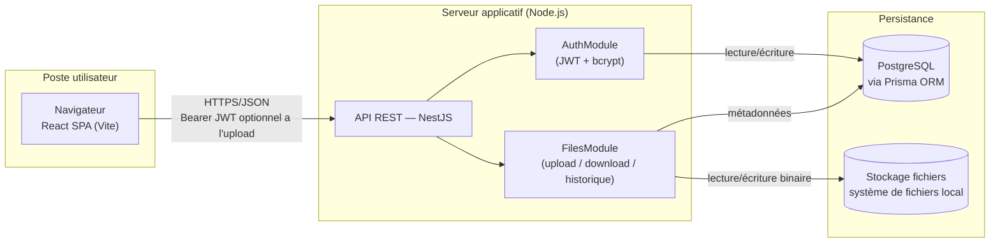

# Architecture de l'application

## Schéma d'architecture

### Légende

Le schéma décrit l'application telle qu'elle est livrée : le MVP (US01 à US06), l'upload anonyme (US07), le mot de passe de fichier (US09) et la durée d'expiration d'US10. Deux fonctionnalités avancées, optionnelles dans les spécifications, ne sont pas réalisées et n'y figurent donc pas : la gestion des tags (US08) et la purge quotidienne des fichiers expirés (US10).

- **Navigateur (React SPA)** : consomme l'API REST en JSON, conserve le token JWT côté client et l'envoie dans l'en-tête `Authorization: Bearer <token>` pour les routes protégées. L'écran d'upload des maquettes ne force pas la connexion : le token est transmis s'il existe, sinon la requête part en anonyme (US07).
- **API REST (NestJS)** : point d'entrée unique, découpée en modules `AuthModule` (inscription/connexion) et `FilesModule` (upload, téléchargement, historique, suppression). La route d'upload utilise un guard d'authentification **optionnelle** (`OptionalJwtAuthGuard`) : si un token valide est fourni, le fichier est rattaché à l'utilisateur (US01, avec historique) ; sans token, l'upload est traité en anonyme (US07, pas d'historique) ; un token fourni mais invalide est refusé en `401` (cf. note sur la mise en œuvre de l'upload anonyme).
- **Pas de tâche planifiée** : la purge quotidienne d'US10 n'est pas réalisée. Un fichier expiré n'est plus téléchargeable (`410`) mais reste stocké, en base et sur le disque (cf. note sur le cycle de vie d'un fichier expiré).
- **PostgreSQL** : source de vérité pour les utilisateurs et les métadonnées des fichiers (nom, taille, date d'expiration, token de lien, mot de passe hashé).
- **Stockage local** : le contenu binaire des fichiers est écrit sur disque, référencé en base par un chemin (`storage_path`). Le service d'accès au stockage est isolé derrière une interface (`StorageService`) pour permettre de basculer vers S3 sans impacter le reste de l'application si le besoin apparaît après le MVP.

### Flux d'échange sécurisé

- Toutes les communications entre le navigateur et le serveur transitent en HTTPS, en développement comme en production. Le navigateur ne s'adresse qu'à une seule origine, qui sert le front et transmet les appels préfixés par `/api` à l'API NestJS. En production, ce rôle revient à un reverse proxy placé devant l'API et le front, qui reste à mettre en place : le prototype n'a pas d'environnement d'hébergement (cf. note sur les scripts de déploiement). En développement, c'est le serveur Vite qui le joue (cf. note ci-dessous).

> **Note — HTTPS en développement.** Les spécifications ne mentionnent pas HTTPS : elles demandent seulement que le mot de passe soit stocké « de manière sécurisée (hashé, salé) » (US03) et que `SECURITY.md` présente une « analyse succincte des décisions » de sécurité. Le passage en HTTPS dès le développement est donc un choix, fait pour que l'environnement de développement reproduise le schéma de production plutôt que de le découvrir au déploiement :
> - **Serveur Vite en HTTPS** avec un certificat auto-signé (`@vitejs/plugin-basic-ssl`), généré au premier démarrage. Le navigateur demande une fois d'accepter le certificat ; la session de debug Chrome de VS Code l'accepte d'office (`--ignore-certificate-errors`, réservé à ce navigateur de debug). Un certificat signé par une autorité locale (mkcert) éviterait l'avertissement, mais demande de l'installer côté Windows, puisque le navigateur tourne hors de WSL : complexité jugée disproportionnée pour le MVP.
> - **API derrière un proxy, sur la même origine.** Le front appelle `/api/...` ; le serveur Vite retire le préfixe et transmet à NestJS, qui reste en HTTP sur le port 3000. Le chiffrement s'arrête donc au proxy, comme il s'arrêtera au reverse proxy en production, et l'API n'a pas à gérer de certificat. Le front et l'API partageant la même origine, la configuration CORS de l'API a été supprimée.
> - **Ce que ça ne change pas.** Le token JWT circule dans l'en-tête `Authorization` et non dans un cookie : aucun attribut `Secure` n'est à prévoir. Le serveur Node de Vite garde son délai maximal de requête par défaut (5 minutes) : sur `localhost`, un upload de 1 Go se termine bien avant.
- Les mots de passe utilisateurs et les mots de passe de protection de fichier sont hashés (bcrypt) avant stockage, jamais en clair.
- Le lien de téléchargement s'appuie sur un token non prédictible (UUID v4), distinct de l'identifiant technique du fichier, qui n'apparaît jamais dans le lien.
- Les fichiers exécutables ou scripts sont refusés à l'upload (contrôle serveur sur l'extension du nom d'origine : `.exe`, `.bat`, `.cmd`, `.com`, `.msi`, `.scr`, `.ps1`, `.vbs`, `.sh`, `.jar`), la liste étant laissée « à définir selon la politique de sécurité » par les spécifications (US01).

### Environnement de développement

PostgreSQL est fourni à l'équipe sous forme de conteneur Docker, démarré via un fichier `docker-compose.yml` versionné à la racine du dépôt. Chaque développeur lance `docker compose up -d` pour obtenir une base identique (même version de PostgreSQL, mêmes identifiants, port exposé identique), sans installation locale de PostgreSQL ni divergence de configuration entre les postes. L'API NestJS (lancée en local via `npm run start:dev` pour profiter du rechargement à chaud) se connecte à cette base via une URL de connexion définie dans `.env`. Le code des trois packages (back, front et package partagé `shared_lib`) s'installe en une seule commande, `npm install` à la racine du dépôt (npm workspaces, cf. note sur le package partagé). Ce même fichier `docker-compose.yml` servira de base au script de déploiement demandé par le cahier des charges (à venir : il ne contient aujourd'hui que PostgreSQL), pour que l'environnement de démonstration reproduise fidèlement l'environnement de développement.

## Choix technologiques justifiés

### Tableau de synthèse

| Élément | Technologie choisie | Alternatives envisagées | Justification |
|---|---|---|---|
| Langage | TypeScript (front et back) | Java, C#, PHP | Un seul langage sur toute la stack réduit le contexte-switching pour un développeur seul sur 4 semaines, et le typage statique limite les bugs d'intégration front/back sur le contrat d'API |
| Back-end | NestJS | Spring Boot, .NET Core, Symfony/Laravel | Architecture modulaire proche de Spring (modules, providers, guards, pipes) mais avec un délai de mise en route bien plus court ; support natif de la validation (`class-validator`), de l'upload (`multer`) et des tâches planifiées (`@nestjs/schedule`) nécessaires au MVP |
| Front-end | React (Vite) | Angular, VueJS | Écosystème le plus large pour trouver rapidement des solutions aux besoins ponctuels (formulaires, routing, appels API) ; Vite offre un démarrage et un rechargement à chaud quasi instantanés, utile en rythme de développement rapide |
| Base de données | PostgreSQL | MongoDB | Les données du MVP sont fortement relationnelles (un utilisateur possède des fichiers, contraintes d'unicité sur l'email et le token de lien) ; un moteur relationnel avec contraintes natives (`UNIQUE`, `FOREIGN KEY`) évite de réimplémenter ces garanties au niveau applicatif |
| ORM | Prisma | TypeORM, Sequelize | Schéma déclaratif unique (`schema.prisma`) qui sert à la fois de source de vérité pour les migrations et de documentation du modèle de données, cohérent avec le MCD |
| Authentification | JWT (Bearer) + bcrypt, via Passport.js | Sessions serveur, OAuth2 | Stateless (pas de session à stocker côté serveur, aligné avec un déploiement simple), standard bien supporté par NestJS (`@nestjs/passport`, `@nestjs/jwt`), suffisant pour le périmètre du MVP (pas de SSO requis) |
| Stockage des fichiers | Système de fichiers local | AWS S3 | Élimine toute dépendance et tout coût cloud pour un prototype démontré en local/sur un seul serveur ; l'accès est isolé derrière une interface `StorageService` pour permettre une migration vers S3 sans réécrire la logique métier si le produit doit scaler après la levée de fonds |
| Hébergement / déploiement | Docker Compose pour PostgreSQL, scripts shell d'installation et de configuration de la base (`scripts/install.sh`, `scripts/setup-db.sh`) ; l'API et le front ne sont pas conteneurisés (cf. note sur les scripts de déploiement) | Hébergement PaaS (Render, Railway) | Reproductible en local pour la démonstration aux investisseurs sans dépendre d'un compte cloud externe ; correspond à l'exigence de scripts de déploiement (installation + configuration BDD) du cahier des charges |
| Base de données en développement | PostgreSQL en conteneur Docker (via Compose) | Installation PostgreSQL locale par poste | Un seul `docker compose up` donne à toute l'équipe la même version et la même configuration de base, sans divergence entre les machines ni pollution de l'OS hôte ; le même fichier Compose servira au déploiement |
| Tests | Vitest (unitaire, front et back) + React Testing Library (composants front) + Supertest (API) + Cypress (e2e) | Jest, Playwright | Vitest est désormais le choix par défaut du CLI Nest comme de Vite (partagé front/back), avec un démarrage et un mode watch nettement plus rapides que Jest ; React Testing Library teste les composants React tels que l'utilisateur les manipule ; Cypress est l'outil cité par les spécifications (« Cypress ou équivalent ») pour les scénarios e2e. Seuil de couverture visé : 70 % (spécifications, `TESTING.md`) |
| Tests de performance | k6 (image Docker), Lighthouse (front) | Artillery, JMeter, autocannon | Outil cité par les spécifications pour le test de charge d'un endpoint critique (`PERF.md`) ; scénarios écrits en JavaScript, cohérent avec le reste de la stack, avec des seuils qui font échouer le test ; Lighthouse mesure le budget de performance du front |
| Logs | pino (`nestjs-pino`), JSON structuré | Winston, logger intégré de Nest | Le plus rapide des loggers Node, une ligne par requête avec sa durée sans code supplémentaire, identifiant de corrélation par requête ; le logger intégré de Nest ne journalise pas les requêtes (cf. note « logs structurés et test de performance ») |
| Sécurité des dépendances | `npm audit` + Trivy (image Docker) | Snyk, OSV-Scanner, Dependabot | `npm audit` est natif et cité par les spécifications ; Trivy ajoute les images Docker, les secrets et la configuration, avec un mécanisme d'exception documentée ; ni compte ni service tiers (cf. note « contrôles automatisés ») |
| Qualité / CI | GitHub Actions, hooks Git natifs (`.githooks/`), oxlint (analyse typée), Prettier | ESLint, GitLab CI, Husky + lint-staged | oxlint (écrit en Rust) remplace ESLint par défaut dans les derniers CLI Nest et Vite, avec un temps d'exécution très inférieur ; le dépôt est hébergé sur GitHub, Actions lance lint, formatage, tests, couverture, `npm audit` et Trivy à chaque push sans infrastructure supplémentaire ; les hooks Git natifs suffisent à lancer les mêmes contrôles en local (cf. note « contrôles automatisés ») |
| Gestion de version | Git + convention "Conventional Commits" | — | Exigé par le cahier des charges (historique Git propre) et facilite la génération d'un changelog pour `MAINTENANCE.md` |
| IDE / outillage | VS Code, oxlint, Prettier, npm (workspaces) | JetBrains WebStorm, ESLint, Yarn/pnpm, Nx/Turborepo | Outillage standard de l'écosystème Node.js/TypeScript, gratuit et largement documenté ; oxlint aligné sur l'état de l'art actuel des générateurs de projet (Nest CLI, Vite) ; les workspaces natifs de npm suffisent à gérer le monorepo (back, front, package partagé) sans outil supplémentaire |

### Détail des arbitrages principaux

**Langage et frameworks.** Le choix d'un stack 100 % TypeScript (NestJS + React) est dicté par la contrainte de délai : un seul développeur doit livrer un MVP complet (auth, upload, téléchargement, historique) en 4 semaines. Unifier le langage entre front et back permet de partager entre les deux applications les types échangés par l'API et les règles de validation (cf. note sur le package partagé ci-dessous), et de réduire le temps perdu à basculer entre écosystèmes. NestJS a été préféré à Express brut pour sa structure imposée (modules, injection de dépendances, guards) qui facilite la lisibilité du code pour une revue ultérieure par l'équipe DataShare, tout en restant beaucoup plus rapide à mettre en œuvre que Spring Boot ou .NET Core pour un projet de cette taille.

> **Note — package partagé front/back (`@datashare/shared-lib`).** Le back et le front manipulent les mêmes données : la forme des requêtes et des réponses de l'API (utilisateur authentifié, réponse de connexion, métadonnées d'un fichier, statut `active` / `expired`) et les mêmes règles de saisie, fixées par les spécifications (mot de passe de compte de 8 caractères minimum, mot de passe de fichier de 6 caractères minimum, tag de 30 caractères maximum, expiration de 1 à 7 jours, taille maximale de 1 Go, extensions interdites). Les spécifications demandent une « validation des données côté client et serveur » (section « Meilleures pratiques à suivre ») : chaque règle existe donc forcément des deux côtés. Écrites deux fois, elles finissent par diverger : un seuil modifié dans un DTO et oublié dans le formulaire donne une saisie acceptée par le front puis refusée par l'API. Ces éléments communs sont donc regroupés dans un package unique, `shared_lib/`, à la racine du dépôt.
>
> **Contenu.** Le package ne contient que du TypeScript sans dépendance à un framework, utilisable tel quel par Node comme par le navigateur :
> - les types des corps de requête et de réponse, alignés sur `docs/api-contract.yaml` (qui reste la référence du contrat) ;
> - les constantes de validation (longueurs, durées, taille, extensions interdites) et les messages d'erreur associés, qui sont les mêmes sous le champ du formulaire et dans la réponse `422` ;
> - les valeurs énumérées communes (statut d'un fichier).
>
> Il ne contient **pas** les DTO `class-validator` (propres à NestJS, ils restent dans le back et importent les constantes du package), ni les composants React (cf. note sur les composants graphiques réutilisables), ni de logique métier : le hash des mots de passe, la génération des liens ou le contrôle d'expiration restent dans le back. Seule exception, `isForbiddenFileName` : c'est une règle de saisie (le contrôle des extensions interdites), appliquée par le formulaire comme par l'API, et testée dans le package lui-même.
>
> **Mise en œuvre.** Le dépôt est un monorepo **npm workspaces** : un `package.json` racine déclare `back`, `front` et `shared_lib` comme espaces de travail, qui importent le package par son nom (`import { PASSWORD_MIN_LENGTH } from '@datashare/shared-lib'`). Les conséquences sont les suivantes :
> - **un seul `npm install` et un seul `package-lock.json`, à la racine**, à la place d'un par application ; les dépendances communes (TypeScript, Vitest, Prettier) ne sont installées qu'une fois ;
> - **les outils communs doivent rester à la même version majeure** dans les trois packages. npm installe une seule copie à la racine quand les versions sont compatibles ; sinon, chaque package garde la sienne, et les extensions de ces outils se rattachent à la mauvaise copie. C'est arrivé à la mise en place : avec Vitest 4 dans le back et Vitest 5 dans le front, les assertions de `@testing-library/jest-dom` n'étaient plus reconnues par le typage du front. Le back a donc été aligné sur Vitest 5 ;
> - **le package est compilé** (`tsc`, JavaScript ESM et déclarations `.d.ts` dans `shared_lib/dist`) : le back s'exécute sous Node en ESM (`nodenext`) et n'exécute pas de TypeScript depuis `node_modules`. Il est compilé automatiquement à chaque `npm install`, et recompilé en continu pendant le développement (`tsc --watch`, lancé par les configurations de debug VS Code) : une modification du package redémarre l'API et recharge le front sans intervention ;
> - **les images Docker** du back et du front, lors de l'écriture des scripts de déploiement, seront construites depuis la racine du dépôt, pour inclure `shared_lib/`.
>
> **Alternatives écartées.**
> - *Dossier `shared_lib/` importé par chemin relatif* (`../../shared_lib/…`), sans package : simple pour des types seuls, mais pour des valeurs il impose de modifier le `rootDir` du back (et donc l'arborescence de `dist/`) et d'autoriser Vite à servir des fichiers hors de `front/`. On obtient les contraintes d'un monorepo sans son outillage standard.
> - *Types générés depuis le contrat OpenAPI* (`openapi-typescript`) : ils supprimeraient la copie des types, mais pas celle des constantes de validation, qui sont justement le principal risque de divergence entre client et serveur.
> - *Duplication contrôlée par les tests* : acceptable avec les deux seuls types de l'authentification, plus avec la dizaine de types et de règles qu'apportent les fonctionnalités sur les fichiers (US01 à US10).
>
> Ce choix ajoute un peu d'outillage à un projet solo (un build de plus et un lockfile déplacé), mais ce coût n'est payé qu'une fois et reste dans les outils natifs de npm (pas de Nx ni de Turborepo). En échange, chaque règle des spécifications n'est écrite qu'à un seul endroit, et une modification du contrat se traduit par une erreur de compilation dans les deux applications au lieu d'un bug à l'exécution.

> **Note — pourquoi pas Next.js ?** Un framework full-stack avec SSR (type Next.js) a été écarté, pour deux raisons tenant aux spécifications elles-mêmes (`docs/P3+EDO+P4+AL+-+Spécifications+pour+l’application.pdf`, section « Stack technique (à choisir) ») et non à une préférence d'implémentation :
> 1. Le cahier des charges impose deux choix **distincts et fermés** : back-end parmi {Spring Boot, .NET Core, NestJS, Symfony/Laravel} et front-end parmi {Angular, React, VueJS}. Next.js ne figure dans aucune des deux listes puisqu'il fusionne les deux rôles — ce n'est donc pas une option technique valide au sens des spécifications.
> 2. La section « Meilleures pratiques à suivre » exige explicitement une « Architecture REST API », ce qui suppose un back-end découplé exposant un contrat d'interface (cf. `docs/api-contract.yaml`) consommé par un client séparé — pas des routes/API handlers intégrés au même projet que le rendu des pages.
>
> Par ailleurs, le SSR n'apporterait que peu de valeur ici : DataShare est un espace applicatif derrière authentification (upload, historique, téléchargement par lien), pas un site de contenu où le SEO ou le temps de premier affichage sur des pages publiques sont déterminants.

> **Note — pourquoi pas Redux / Redux Toolkit ?** Aucune librairie de state management global n'est utilisée côté front ; le cahier des charges n'impose d'ailleurs que le choix du framework (React), pas d'outil de gestion d'état. La quasi-totalité de ce qui serait un « état global » dans une autre application est ici de l'**état serveur** (liste des fichiers de l'historique, métadonnées d'un fichier avant téléchargement) : chaque écran va le chercher via l'API au moment où il en a besoin, plutôt que de le dupliquer dans un store client. Le seul état réellement partagé entre composants est le token JWT de l'utilisateur connecté, trop simple pour justifier un store Redux dédié — un Context React suffit. Redux/RTK apporterait une structure plus prévisible et des devtools utiles si l'application grossissait fortement (beaucoup d'écrans consommant les mêmes données en parallèle), mais ce n'est pas le profil d'un MVP solo en 4 semaines avec un nombre d'écrans limité (login, upload, historique, téléchargement).

> **Note — composants graphiques réutilisables.** Les maquettes (`docs/maquette/`) reposent sur un nombre restreint de briques visuelles qui se répètent d'un écran à l'autre (boutons, champs de saisie, cartes, bandeaux d'information, en-tête). Plutôt que de dupliquer ces éléments dans chaque page, ils sont regroupés dans un dossier `src/components/ui/` côté front, selon une règle simple appliquée au fil des développements : **un élément devient un composant réutilisable uniquement lorsqu'il est nécessaire à au moins deux écrans**. Un élément propre à un seul écran reste défini localement dans cet écran ; il n'est extrait en composant partagé qu'au moment où un second usage apparaît réellement, et pas par anticipation.
>
> Au vu des maquettes, les composants partagés attendus sont les suivants :
>
> | Composant | Écrans concernés | Variantes / états couverts |
> |---|---|---|
> | `Button` | Tous (Connexion, Créer mon compte, Téléverser, Télécharger, Copier le lien, Supprimer, Accéder, Se connecter / Mon espace) | Plein, contour, lien, sombre ; actif / désactivé ; icône optionnelle |
> | `Input` (label + champ) | Connexion, inscription, upload (mot de passe optionnel), téléchargement (mot de passe) | Texte, email, mot de passe ; message d'erreur de validation |
> | `Callout` | Téléchargement (fichier bientôt expiré, expiré), upload (erreur de taille) | Information, avertissement, erreur |
> | `Card` (carte blanche avec titre) | Connexion, Créer un compte, Ajouter un fichier, Télécharger un fichier | — |
> | `Header` | Tous les écrans publics | Action « Se connecter » (anonyme) ou « Mon espace » (connecté) ; mobile / desktop |
> | `PublicLayout` (fond dégradé + en-tête + pied de page) | Accueil, Connexion, Créer un compte, Téléversement, Téléchargement | — |
> | `FileInfo` (icône + nom tronqué + taille ou expiration) | Ajout de fichier, téléchargement, historique « Mes fichiers » | Taille, date d'expiration, état expiré |
>
> À l'inverse, les éléments suivants n'apparaissent que sur un seul écran et ne font **pas** l'objet d'un composant générique : la liste déroulante d'expiration (un `<select>` natif stylé suffit), le filtre « Tous / Actifs / Expiré » et la mise en page avec barre latérale de « Mes fichiers », ainsi que le bouton rond d'upload de l'accueil. Ils peuvent être placés dans leur propre fichier pour la lisibilité et les tests, mais sans chercher à les rendre paramétrables au-delà de leur unique usage.
>
> Ce choix reste volontairement léger : pas de librairie de composants externe (MUI, shadcn/ui…), pas de package de composants dédié (le package `@datashare/shared-lib` ne contient aucun composant, cf. note sur le package partagé) ni de Storybook, qui représenteraient un coût de mise en place et de maintenance disproportionné pour un MVP de quatre écrans développé seul en 4 semaines. Les composants partagés n'exposent que les variantes effectivement présentes dans les maquettes. En contrepartie, ils constituent une cible privilégiée pour les tests unitaires front (Vitest + React Testing Library) : par exemple, vérifier qu'un `Button` désactivé ne déclenche pas d'action ou qu'un `Callout` affiche l'icône correspondant à sa variante. Un défaut corrigé dans un composant partagé est ainsi corrigé sur tous les écrans qui l'utilisent.

**Base de données.** Le modèle de données (cf. `docs/mcd.md`) reste composé d'entités liées par des relations simples et des contraintes d'unicité fortes (email, token de téléchargement, couple fichier/tag). PostgreSQL apporte ces garanties nativement et reste largement suffisant en performance pour un prototype ; MongoDB n'apporterait pas de bénéfice ici puisqu'il n'y a pas de besoin de schéma flexible ou de volumétrie massive.

> **Note — cycle de vie d'un fichier expiré.** Les spécifications posent deux exigences à concilier : le fichier et ses métadonnées sont supprimés à expiration (US01, US10 — « une tâche planifiée purge les fichiers expirés chaque jour »), mais l'historique affiche « l'état du lien (valide ou expiré) » (US05) et un lien expiré doit renvoyer « une erreur explicite » (US02). La conception prévoit donc trois états, la purge étant quotidienne :
> 1. **Actif** (`expires_at` dans le futur) : téléchargeable, visible dans l'historique.
> 2. **Expiré, pas encore purgé** (`expires_at` dépassé) : le téléchargement est refusé par un contrôle applicatif sur `expires_at` (réponse `410 Gone`, distincte du `404` d'un lien inconnu, pour l'écran « fichier expiré » des maquettes) ; le fichier reste visible dans l'historique avec le statut `expired`.
> 3. **Purgé** : métadonnées et binaire supprimés, le lien renvoie `404`.
>
> La purge (US10, optionnelle) n'est pas réalisée : un fichier expiré reste à l'état 2. Son propriétaire peut le supprimer par l'API (`DELETE /files/{id}`), mais l'écran « Mes fichiers » ne le propose pas ; un fichier anonyme expiré y reste indéfiniment. L'expiration elle-même ne dépend pas du cron, qui n'aurait fait que libérer l'espace : seul l'espace disque est concerné (cf. `MAINTENANCE.md`). Conformément à US06 (« seuls les fichiers non expirés sont affichés par défaut dans l'historique »), `GET /files` ne renvoie par défaut que les fichiers actifs ; le filtre « Tous / Actifs / Expiré » des maquettes s'appuie sur le paramètre `status` (cf. `docs/api-contract.yaml`).

> **Note — codes d'erreur HTTP.** Les spécifications (`docs/P3+EDO+P4+AL+-+Spécifications+pour+l’application.pdf`) font référence pour la gestion des erreurs. Elles imposent :
> - une « erreur explicite » pour un lien expiré ou invalide (US02) ;
> - une validation des données « côté client et serveur » (section « Meilleures pratiques à suivre »), précisée par les « contrôles de saisie » de chaque user story : par exemple, le mot de passe de téléchargement est « à valider côté client et serveur » (US02) et le champ d'expiration est « validé côté serveur » (US10) ;
> - une confirmation côté front-end avant la suppression d'un fichier (US06) ;
> - une « gestion d'erreurs appropriée » (section « Meilleures pratiques à suivre »).
>
> Elles ne nomment en revanche **aucun code HTTP**. Le choix des codes est donc une convention du projet, retenue pour satisfaire l'exigence d'une gestion « appropriée » : un même type d'erreur reçoit le même code sur toutes les routes, et chaque erreur porte un message explicite en français, affichable tel quel par le front (champ `message`) :
>
> | Code | Signification | Exemples |
> |---|---|---|
> | `400` | Requête illisible | Corps JSON ou multipart mal formé |
> | `401` | Authentification refusée | Token absent, invalide ou expiré ; identifiants incorrects (US04) ; mot de passe d'un fichier incorrect (US02, US09) |
> | `403` | Action interdite à l'utilisateur connecté | Suppression du fichier d'un autre utilisateur (US06) |
> | `404` | Ressource inconnue | Lien invalide ou fichier déjà purgé (US02) |
> | `409` | Conflit avec une donnée existante | Email déjà utilisé (US03) |
> | `410` | Lien expiré, pas encore purgé | Cf. note sur le cycle de vie d'un fichier expiré (US02, US10) |
> | `422` | Contrôle de saisie non respecté | Tout ce que les spécifications rangent dans les « contrôles de saisie » : format de l'email, longueur des mots de passe, taille du fichier (1 Go), extensions interdites, durée d'expiration, longueur et doublons des tags, mot de passe absent pour un fichier protégé |
>
> Le `422` regroupe volontairement tous les « contrôles de saisie » des spécifications, y compris la taille du fichier et les extensions interdites. Le client peut ainsi traiter de la même façon toute erreur à corriger par l'utilisateur dans le formulaire. Le `400` ne sert qu'aux requêtes que le serveur ne peut pas lire : c'est le comportement par défaut de NestJS pour un corps mal formé. Le dépassement de taille, que la librairie d'upload (`multer`) signale par défaut en `413`, est converti en `422` (cf. note sur la mise en œuvre de l'upload et du téléchargement).

**Stockage des fichiers.** Le choix du système de fichiers local plutôt que S3 est un arbitrage explicite de simplicité pour le MVP : il évite la gestion de credentials AWS et de coûts variables pendant la phase de prototypage, tout en démontrant aux investisseurs une architecture pensée pour évoluer (interface `StorageService` remplaçable).

> **Note — mise en œuvre de l'upload et du téléchargement (US01 / US02).** Les spécifications fixent les règles : fichier de 1 Go maximum, fichiers dangereux refusés, lien « associé à un identifiant unique non prédictible », expiration de 7 jours par défaut et réglable, mot de passe optionnel « requis pour accéder au téléchargement », métadonnées « visibles avant téléchargement » et « erreur explicite » pour un lien expiré ou invalide. Dans ce cadre, les choix suivants ont été faits :
> - **Périmètre.** US01 et US02 citent toutes deux le mot de passe optionnel et le choix de la durée : ils sont livrés avec elles, ce qui couvre aussi l'essentiel d'US09. Restaient pour leurs propres user stories, finalement non réalisées : les tags (US08, qui demandent leur table) et la purge quotidienne (US10). L'upload anonyme (US07) a été livré ensuite : `POST /files`, d'abord réservé aux utilisateurs connectés, accepte désormais les visiteurs (cf. note sur la mise en œuvre de l'upload anonyme).
> - **Le fichier ne passe jamais par la mémoire.** `multer` écrit le fichier sur le disque au fil de la réception, dans un dossier temporaire situé sous `STORAGE_DIR` ; une fois la requête validée, `StorageService` le déplace dans le stockage. Les deux dossiers étant sur le même disque, ce déplacement est un simple renommage, instantané même pour 1 Go. Un fichier de plus de 1 Go est coupé dès que la limite est atteinte, sans être reçu en entier.
> - **Contrôles au plus tôt.** L'authentification est vérifiée avant la lecture du corps : une requête dont le token est invalide ou expiré est refusée sans que son fichier soit écrit (une requête sans token est acceptée comme anonyme depuis US07). L'extension est contrôlée sur l'en-tête de la partie « fichier », avant tout octet écrit. Si la requête échoue après l'écriture (mot de passe trop court, durée invalide, erreur de base), un intercepteur supprime le fichier temporaire : un upload refusé ne laisse rien sur le disque. Ce même intercepteur convertit le `413` de `multer` en `422` (cf. note sur les codes d'erreur HTTP).
> - **Le nom d'origine ne sert jamais de nom sur le disque.** Le fichier est stocké sous un UUID aléatoire, et le nom choisi par l'utilisateur n'est conservé qu'en base. Un nom malveillant (`../../etc/passwd`, caractères réservés) ne peut donc pas atteindre le système de fichiers. Les noms accentués sont décodés en UTF-8, comme les envoient les navigateurs.
> - **Extensions interdites plutôt qu'extensions autorisées.** Les spécifications laissent les fichiers interdits « à définir selon la politique de sécurité (ex. .exe, .bat, etc.) ». Une liste des types autorisés bloquerait des usages légitimes d'un service de partage généraliste (archives, formats métier). Le choix s'est donc porté sur une liste d'exécutables et de scripts refusés (cf. « Flux d'échange sécurisé »), partagée par le formulaire et l'API. Ce contrôle protège le destinataire d'une erreur de manipulation, mais pas d'un expéditeur malveillant : un exécutable renommé en `.pdf` ou placé dans une archive passe. Seule une analyse antivirus du contenu (ClamAV par exemple) le détecterait, ce qui sort du périmètre du MVP.
> - **Mot de passe du fichier (US01 / US09).** Il est haché avec bcrypt, avec le même coût que celui du compte (10) et le même plafond de 72 octets (cf. note sur l'authentification). Un champ laissé vide signifie « pas de mot de passe », et non « mot de passe trop court ». Conformément à US09, aucune récupération n'est possible : un mot de passe oublié rend le fichier inaccessible. Au téléchargement, le contenu n'est lu sur le disque qu'une fois le mot de passe vérifié.
> - **Durée d'expiration.** L'API calcule `expires_at` en heures exactes (date d'upload + N × 24 h) et refuse toute durée hors de 1 à 7 jours (US10 : « validé côté serveur »). Le front affiche l'échéance en jours calendaires (« aujourd'hui », « demain », « dans N jours ») et passe en avertissement le jour même et la veille, comme les maquettes. Un fichier déposé à 23 h pour une journée expire donc le lendemain à 23 h, et non à minuit.
> - **Un jeton de lien distinct de l'identifiant.** Le lien porte un UUID v4 (122 bits aléatoires, `crypto.randomUUID`), impossible à deviner ou à énumérer, et jamais l'identifiant technique du fichier. Il pointe vers l'écran de téléchargement du front (`<FRONT_URL>/f/<jeton>`), qui interroge ensuite l'API.
> - **Deux routes pour le téléchargement.** `GET /f/{jeton}` renvoie les métadonnées affichées avant le téléchargement, puis `POST /f/{jeton}/download` envoie le contenu. Le `POST` fait voyager le mot de passe dans le corps de la requête, jamais dans une URL, qui finirait dans l'historique du navigateur et les journaux des serveurs. Un lien inconnu renvoie `404`, un lien expiré `410`, dès la date dépassée et sans attendre la purge (cf. note sur le cycle de vie d'un fichier expiré).
> - **Le mot de passe protège le contenu, pas les métadonnées.** US02 impose que les métadonnées (nom, type, taille, date d'expiration) soient « visibles avant téléchargement » : `GET /f/{jeton}` les renvoie à toute personne qui détient le lien, même pour un fichier protégé. Le nom d'un fichier protégé n'est donc pas confidentiel, ce qu'il faut garder en tête avant d'y mettre une information sensible.
> - **Un lien réutilisable jusqu'à son expiration.** Comme le prévoient les spécifications, le nombre de téléchargements n'est pas limité. Le seul moyen de couper un lien avant son expiration est de supprimer le fichier (US06).
> - **Le fichier n'est jamais affiché par le navigateur.** Le contenu est toujours envoyé en `application/octet-stream`, en pièce jointe (`Content-Disposition: attachment`) et avec `X-Content-Type-Options: nosniff`, quel que soit le type déclaré à l'upload. Un fichier HTML ou SVG piégé ne peut donc pas s'exécuter comme une page de l'origine de l'API. Le type déclaré par le navigateur n'est conservé que pour l'affichage.
> - **Durée maximale d'une requête.** Node interrompt par défaut toute requête qui dure plus de 5 minutes (`requestTimeout`), ce qui couperait l'envoi de 1 Go sur une connexion de moins de 27 Mbit/s environ. Ce délai est porté à une heure dans `main.ts`, ce qui couvre 1 Go jusqu'à environ 2,5 Mbit/s. Le délai de réception des en-têtes (60 s) est conservé : un client qui n'envoie jamais ses en-têtes complets est toujours déconnecté. Les requêtes passant par un proxy (cf. note « HTTPS en développement »), celui-ci doit accepter le même délai : en production, le reverse proxy sera configuré en conséquence ; en développement, le serveur Vite garde ses 5 minutes, sans effet sur `localhost`.
> - **Téléchargement côté front.** L'écran récupère le fichier avec `fetch`, puis le remet au navigateur, qui l'enregistre sous son nom d'origine. Cette méthode garde un traitement d'erreur unique (mot de passe incorrect affiché sous le champ, lien expiré entre-temps), mais elle charge le fichier en mémoire dans le navigateur avant de l'enregistrer : c'est acceptable pour les tailles courantes, plus lourd à l'approche de 1 Go. Si le besoin apparaît, une évolution possible est un lien de téléchargement direct à usage unique, émis par l'API une fois le mot de passe vérifié, que le navigateur enregistre au fil de l'eau.
>
>   **À implémenter dans une itération future** (hors périmètre du MVP) :
>   1. limiter les tentatives de mot de passe sur `POST /f/{jeton}/download`, comme pour la connexion (cf. note sur l'authentification), puisqu'un mot de passe de fichier n'a que 6 caractères minimum ;
>   2. supprimer les fichiers orphelins. L'intercepteur ne nettoie que les erreurs traitées par l'application : si le processus s'arrête pendant une réception, ou entre le déplacement du fichier et son enregistrement en base, un fichier reste sur le disque sans être référencé. La purge quotidienne (US10) devra donc aussi vider les fichiers de `tmp/` de plus d'un jour ;
>   3. borner l'espace disque. Il n'existe ni quota par utilisateur, ni plafond global, ni limite au nombre d'uploads : quelques dizaines de fichiers de 1 Go suffisent à remplir un disque. Un quota par compte et une limitation du nombre d'uploads par minute (`@nestjs/throttler`, comme pour la connexion) sont les deux mesures prioritaires. Depuis US07, l'upload n'exige plus de compte : la limitation par adresse IP devient la seule protection possible pour les visiteurs (cf. note sur la mise en œuvre de l'upload anonyme) ;
>   4. afficher la progression de l'upload. `fetch` ne permet pas de suivre l'envoi, et les maquettes n'en montrent pas : pour un gros fichier, l'utilisateur ne voit que « Téléversement… » pendant plusieurs minutes. `XMLHttpRequest` (événement `upload.onprogress`) permettrait d'afficher un pourcentage ;
>   5. au déploiement, monter `STORAGE_DIR` sur un volume persistant et le sauvegarder en même temps que la base : restaurer l'un sans l'autre laisse des fichiers sans métadonnées, ou des métadonnées sans fichier (à reprendre dans `MAINTENANCE.md`).

> **Note — mise en œuvre de l'historique et de la suppression (US05 / US06).** Les spécifications fixent les règles : l'historique affiche « le nom du fichier, sa taille, sa date d'envoi, sa date d'expiration, l'état du lien (valide ou expiré) », « aucun tri ni filtrage n'est obligatoire », mais « seuls les fichiers non expirés sont affichés par défaut » (US06). La suppression est « physique » (fichier et métadonnées) et « irréversible », demande une « confirmation de l'action côté front-end », et « l'utilisateur ne peut supprimer que ses propres fichiers ». Dans ce cadre, les choix suivants ont été faits :
> - **Le propriétaire vient toujours du token.** `GET /files` ne renvoie que les fichiers dont le propriétaire est l'utilisateur du JWT, et aucune route ne reçoit l'identifiant d'un utilisateur en paramètre : un utilisateur ne peut donc pas demander la liste d'un autre.
> - **« Actifs » par défaut, et non « Tous » comme sur la maquette.** La maquette présélectionne « Tous », mais US06 impose l'inverse : les spécifications priment. Le filtre « Tous / Actifs / Expiré » est appliqué par l'API (paramètre `status`), avec la même règle d'expiration que le téléchargement (`expires_at` dépassé), évaluée à un instant unique pour le filtre et le statut affiché. Un fichier expiré reste listé jusqu'à la purge quotidienne (cf. note sur le cycle de vie d'un fichier expiré). Les fichiers sont renvoyés du plus récent au plus ancien : aucun tri n'est exigé, mais un ordre stable évite que la liste change d'un chargement à l'autre.
> - **Plus d'informations que sur la maquette.** La maquette n'affiche que l'échéance (« Expire demain »). US05 exige aussi la taille, la date d'envoi et la date d'expiration : chaque ligne indique donc « 2,6 Mo · Envoyé le 06/10/2026 · Expire dans 3 jours, le 09/10/2026 », l'échéance restant relative pour le jour même et le lendemain, comme sur la maquette.
> - **Le lien de partage dans l'historique.** Le bouton « Accéder » de la maquette ouvre la page de téléchargement : chaque élément de `GET /files` porte donc son lien (`downloadUrl`, ajouté au contrat d'API). Le propriétaire peut ainsi retrouver un lien perdu après l'upload ; le jeton n'est exposé qu'à lui.
> - **`403` pour le fichier d'un autre utilisateur.** C'est le code prévu par le contrat d'API (cf. note sur les codes d'erreur HTTP). Il révèle qu'un identifiant existe, mais les identifiants sont des UUID v4 aléatoires, qui n'apparaissent que dans l'historique de leur propriétaire : rien ne permet de les deviner. Un fichier déposé anonymement (US07) n'a pas de propriétaire : personne ne peut le supprimer, il disparaît à la purge.
> - **Un identifiant mal formé répond `404`.** Une valeur qui n'est pas un UUID ne peut désigner aucun fichier : elle reçoit la même réponse qu'un identifiant inconnu, plutôt qu'un `422` (ce n'est pas un contrôle de saisie des spécifications) ou que l'erreur de PostgreSQL sur une colonne de type `uuid`.
> - **Les métadonnées d'abord, puis le contenu.** Une fois la ligne supprimée en base, le lien répond `404` immédiatement. L'ordre inverse pourrait laisser, en cas d'échec entre les deux, un lien valide vers un contenu absent. Dans l'ordre retenu, l'échec laisse au pire un fichier orphelin sur le disque, que le nettoyage prévu pour la purge (point 2 de la note sur l'upload et le téléchargement) supprimera. Deux suppressions simultanées du même fichier (deux onglets) donnent `204` puis `404`, sans erreur serveur.
> - **Un fichier expiré peut être supprimé par l'API**, puisque la purge prévue par US10 l'aurait fait de toute façon. L'écran suit la maquette : un fichier expiré n'a pas de bouton, seulement le message « Ce fichier a expiré, il n'est plus stocké chez nous ».
> - **Confirmation par la boîte de dialogue du navigateur** (`window.confirm`), qui rappelle le nom du fichier et le caractère irréversible de l'action. Les maquettes ne dessinent pas de fenêtre de confirmation, et la boîte native est accessible au clavier et aux lecteurs d'écran sans code supplémentaire. Une fenêtre aux couleurs de l'application (élément `<dialog>`) reste une évolution possible.
> - **Session expirée.** Si l'API répond `401` (token expiré), l'écran déconnecte l'utilisateur : `RequireAuth` le renvoie vers la connexion, qui le ramène ensuite à son espace.
> - **Écarts assumés avec la maquette mobile.** Le menu « ⋮ » de chaque ligne est remplacé par les mêmes boutons que sur ordinateur, qui passent sous le nom du fichier quand la largeur manque : un menu déroulant accessible (clavier, focus, fermeture) coûterait plus de code pour le même service. L'en-tête mobile n'affiche pas de nom ni de photo : un compte n'a qu'un email (US03). La barre latérale devient un tiroir ouvert par le bouton menu, comme sur la maquette.
> - **Accessibilité du filtre.** Le filtre « Tous / Actifs / Expiré » est un `<fieldset>`, l'élément natif pour un groupe de contrôles. Le fond de l'option sélectionnée est plus sombre que sur la maquette (`#c8414b` au lieu de `#e0626a`) : avec un texte blanc, la couleur d'origine n'atteint qu'un contraste de 3,4:1, sous le minimum de 4,5:1 du niveau AA des WCAG ; la couleur retenue atteint 4,9:1. Ces deux points viennent de l'analyse SonarQube (règles S6819 et S7924).
> - **Tags.** US08 (optionnelle) n'est pas réalisée : le champ `tags` et le filtre `tag`, prévus à la conception, ont été retirés du contrat d'API pour qu'il ne décrive que ce que l'API fait. Un paramètre `tag` envoyé malgré tout est ignoré.

> **Note — mise en œuvre de l'upload anonyme (US07).** Les spécifications sont brèves : « un utilisateur non authentifié peut déposer un fichier, comme en mode connecté », « les règles de gestion sont identiques à US01, mais le fichier n'est pas lié à l'identifiant utilisateur », « le lien de téléchargement est généré de la même manière », et les contrôles de saisie sont « identiques à l'upload avec compte ». Dans ce cadre, les choix suivants ont été faits :
> - **Une seule route, une seule implémentation.** `POST /files` sert les deux cas : le contrôleur transmet au service l'identifiant de l'utilisateur ou `null`, et rien d'autre ne change. Les règles « identiques » des spécifications le sont donc par construction (taille, extensions interdites, mot de passe, durée, jeton du lien), sans second chemin de code à maintenir en parallèle. La colonne `owner_id` était nullable dès le modèle de données (cf. `docs/mcd.md`) : US07 ne demande aucune migration.
> - **Authentification optionnelle, mais jamais ignorée.** `OptionalJwtAuthGuard` distingue trois cas : token valide (fichier rattaché au compte), aucun en-tête `Authorization` (upload anonyme), en-tête présent mais token invalide, expiré ou mal formé (`401`). Les spécifications sont muettes sur ce dernier cas ; le contrat d'API le prévoit (« Bearer token fourni mais invalide ou expiré »). Le traiter comme un upload anonyme serait plus simple, mais trompeur : un utilisateur dont la session vient d'expirer recevrait un lien valide pour un fichier sans propriétaire, absent de son historique (US05) et impossible à supprimer (US06). Le `401` lui permet de se reconnecter avant d'envoyer.
> - **Le refus arrive avant l'écriture du fichier.** Le guard s'exécute avant `multer` : une requête au token invalide ne laisse rien sur le disque, comme les autres refus (cf. note sur l'upload et le téléchargement).
> - **Ce qu'un fichier anonyme n'a pas.** Sans propriétaire, il n'apparaît dans aucun historique et personne ne peut le supprimer : `DELETE /files/{id}` répond `403` à tout utilisateur connecté. Son dépositaire ne retrouve donc jamais son lien s'il le perd, et son lien cesse de fonctionner à l'expiration ; le fichier lui-même reste stocké, la purge quotidienne d'US10 n'étant pas réalisée.
> - **Côté front, le même écran.** L'accueil ne renvoie plus le visiteur vers la connexion : le formulaire d'upload est celui d'US01, et il transmet le token de la session s'il existe. Les maquettes ne prévoient d'ailleurs aucun écran distinct pour le visiteur. Si l'API répond `401`, le formulaire invite à se reconnecter sans déconnecter l'utilisateur : le déconnecter ferait repartir sa tentative suivante en anonyme, sans qu'il le sache.
> - **Un upload ouvert à tous est une surface d'abus.** Avant US07, il fallait au moins un compte pour écrire sur le disque du serveur ; ce n'est plus le cas. Les spécifications ne demandent aucune limite, et le MVP n'en ajoute pas, mais le risque est réel : stockage saturé par des envois répétés de 1 Go, ou hébergement de contenus illicites sans aucun auteur identifiable.
>
>   **À implémenter dans une itération future** (hors périmètre du MVP) :
>   1. limiter le nombre d'uploads par adresse IP (`@nestjs/throttler`, réponse `429`), avec un plafond plus bas pour les visiteurs que pour les comptes : c'est la mesure prioritaire, complément du point 3 de la note sur l'upload et le téléchargement ;
>   2. abaisser la taille ou la durée maximales pour les visiteurs, ce qui serait un écart assumé avec la règle « identique à US01 » des spécifications ;
>   3. journaliser l'adresse IP et la date d'un upload anonyme, pour pouvoir répondre à un signalement de contenu illicite (à cadrer avec le RGPD dans `SECURITY.md`) ;
>   4. indiquer au visiteur, sur l'écran du lien, qu'il ne pourra ni retrouver ni supprimer son fichier sans compte.

**Sécurité.** JWT + bcrypt couvrent les exigences de sécurité du cahier des charges (authentification, mots de passe hashés) sans complexité additionnelle d'un serveur d'autorisation OAuth2, non nécessaire pour un MVP mono-application sans intégration tierce.

> **Note — mise en œuvre de l'authentification (US03 / US04).** Les spécifications fixent le cadre : email unique au format valide, mot de passe d'au moins 8 caractères « hashé, salé », pas de rôle ni d'email de confirmation, et un « token JWT généré et transmis au client » pour authentifier les requêtes. Dans ce cadre, les choix suivants ont été faits :
> - **Token renvoyé dès l'inscription.** `POST /auth/register` renvoie la même réponse que `POST /auth/login` (token + utilisateur) : l'utilisateur qui vient de créer son compte arrive directement dans son espace, sans ressaisir ses identifiants.
> - **Unicité de l'email garantie par la base.** L'email est normalisé (espaces retirés, minuscules) avant tout traitement, pour que « Alice@Mail.fr » et « alice@mail.fr » désignent le même compte. Le doublon est détecté par la contrainte `UNIQUE` de PostgreSQL (erreur Prisma `P2002`, traduite en `409`), et non par une lecture préalable qui laisserait passer deux inscriptions simultanées.
> - **Pas d'indice pour deviner les comptes existants.** À la connexion, un email inconnu et un mauvais mot de passe renvoient le même `401` avec le même message. Un hash bcrypt factice est comparé quand l'email est inconnu, pour que le temps de réponse ne trahisse pas non plus l'existence du compte.
> - **Validation des deux côtés.** Les spécifications demandent une « validation des données côté client et serveur ». Côté serveur, les DTO (`class-validator`) font foi et une saisie invalide renvoie `422` (cf. note sur les codes d'erreur HTTP et `docs/api-contract.yaml`). Côté client, les mêmes règles sont appliquées pour afficher l'erreur sous le champ sans aller-retour serveur. Les limites et les messages ne sont écrits qu'une fois, dans le package `@datashare/shared-lib` (cf. note sur le package partagé), utilisé par les DTO comme par les formulaires : le front et l'API acceptent et refusent exactement les mêmes saisies, avec le même message. Seules les règles propres à l'interface restent dans le front : la confirmation du mot de passe, présente dans les maquettes, et le message « email requis » pour un champ vide.
> - **Token stocké dans le `localStorage`.** Il est envoyé dans l'en-tête `Authorization: Bearer`, comme le prévoit le contrat d'API. Un cookie `httpOnly` protégerait mieux le token d'une faille XSS, mais imposerait une protection CSRF et une configuration CORS avec cookies, disproportionnées pour le MVP. Le risque XSS est limité par React, qui échappe le contenu affiché. La durée de vie du token est bornée (`JWT_EXPIRES_IN`, 1 jour par défaut), sans refresh token. Au chargement, le front ignore un token dont la date d'expiration est dépassée, plutôt que d'afficher l'utilisateur comme connecté jusqu'au premier `401`.
> - **Coût bcrypt de 10.** C'est la valeur par défaut de la librairie : environ 50 à 100 ms par hash, assez lent pour freiner une attaque par force brute sans pénaliser l'inscription ni la connexion.
> - **Longueur maximale de 72 octets.** Les spécifications ne fixent qu'un minimum (8 caractères), mais l'algorithme bcrypt ne prend en compte que les **72 premiers octets** du mot de passe : la librairie `bcrypt` utilisée ici tronque silencieusement le reste, sans erreur. L'effet de bord est le suivant : pour un compte créé avec 72 « a » suivis de « X », la connexion est aussi acceptée avec 72 « a » suivis de « Y », ou avec les 72 « a » seuls (comportement vérifié sur la version du projet). Concrètement :
>   - la fin d'un mot de passe long ne protège rien, alors que l'utilisateur croit qu'elle compte. Le cas est réaliste avec une phrase de passe ou un mot de passe généré par un gestionnaire (souvent 64 à 128 caractères) ;
>   - un attaquant qui connaît ou devine le début d'un tel mot de passe n'a pas besoin du reste ;
>   - la troncature dépend de l'implémentation : d'autres librairies bcrypt refusent l'entrée au lieu de la tronquer. Si le hash changeait un jour de librairie, des utilisateurs dont le mot de passe dépasse 72 octets ne pourraient plus se connecter.
>
>   L'inscription refuse donc un mot de passe de plus de 72 octets UTF-8 (`422`), côté serveur comme côté client : ce qui est saisi est exactement ce qui est vérifié. La limite est exprimée en octets et non en caractères, un caractère accentué en occupant deux ; le message affiché parle de « 72 caractères » pour rester compréhensible, ce qui est exact pour un mot de passe sans accent. La connexion n'applique pas cette limite : aucun compte ne peut avoir un mot de passe plus long. Le même plafond s'appliquera au mot de passe de protection d'un fichier (US09), lui aussi hashé avec bcrypt.
> - **Pas de règle de composition (chiffres, caractères spéciaux).** Conformément aux spécifications (US03 : « minimum 8 caractères », sans autre exigence), aucune combinaison de types de caractères n'est imposée. C'est aussi la position du NIST (SP 800-63B), qui déconseille ces règles : elles produisent des mots de passe prévisibles (`Motdepasse1!`) sans les rendre plus robustes, alors que la longueur compte davantage. En contrepartie, la robustesse ne peut pas reposer sur le seul mot de passe : avec 8 caractères minimum, `12345678` ou `motdepasse` sont acceptés, et rien ne limite aujourd'hui le nombre de tentatives de connexion, ce qui laisse une attaque par dictionnaire possible (bcrypt la ralentit, sans la bloquer). La CNIL recommande d'ailleurs de compenser un mot de passe court par une restriction des tentatives.
>
>   **À implémenter dans une itération future** (hors périmètre du MVP) :
>   1. limiter les tentatives sur `POST /auth/login` et `POST /auth/register` par adresse IP, avec le module officiel `@nestjs/throttler` (par exemple 5 essais par minute, réponse `429 Too Many Requests`). C'est la mesure prioritaire ;
>   2. refuser les mots de passe les plus courants (liste embarquée de quelques centaines d'entrées : `12345678`, `motdepasse`, `azertyui`…), comme le recommande également le NIST.

**Environnement de développement.** Faire tourner PostgreSQL dans un conteneur Docker plutôt que de demander à chaque développeur de l'installer en local supprime les écarts de version et de configuration entre les postes (source classique de bugs « ça marche chez moi »). Cela permet aussi de repartir d'une base propre en une commande (`docker compose down -v && docker compose up -d`), ce qui est précieux en phase de prototypage où le schéma évolue vite.

**Tests et lint.** Les générateurs de projet officiels (Nest CLI et `create-vite`) proposent désormais Vitest et oxlint par défaut, en remplacement de Jest et ESLint historiquement recommandés. Ce projet suit cet état de l'art : Vitest s'intègre nativement à Vite côté front (pas de configuration Babel/ts-jest additionnelle) et partage la même API côté back, tandis qu'oxlint (implémenté en Rust) réduit fortement le temps de lint par rapport à ESLint, sans nécessiter de configuration manuelle pour démarrer.

> **Note — simulation des appels API dans les tests front.** Chaque couche de test a sa propre façon de gérer le réseau. Côté back, Supertest appelle directement l'application NestJS, branchée sur une base PostgreSQL de test. Côté e2e, Cypress interroge le vrai back (cf. note suivante), et `cy.intercept` (intégré à Cypress) pourra servir à provoquer les cas difficiles à reproduire, comme une erreur 500. Côté front, les composants partagés (`src/components/ui/`) ne reçoivent que des props et n'appellent jamais l'API. Les écrans passent tous par un module unique d'accès à l'API (`src/api/`), et leurs tests le remplacent par défaut avec `vi.mock`. Cette approche ne demande ni dépendance ni configuration supplémentaire, et elle oblige à séparer l'interface du transport HTTP.
>
> En complément, et dans un but pédagogique, quelques tests utilisent **MSW** (Mock Service Worker). MSW intercepte les requêtes au niveau réseau : le vrai code d'appel (`fetch`, en-têtes, lecture des codes HTTP) est donc exécuté, alors que `vi.mock` le court-circuite. MSW est réservé à l'**écran de téléchargement** (`/f/:token`, US02 / US09), qui est le plus pertinent pour deux raisons :
> 1. C'est l'écran qui enchaîne le plus de réponses HTTP différentes du contrat d'API (`docs/api-contract.yaml`). `GET /f/{token}` renvoie `200`, `404` ou `410` (lien expiré, cf. note sur le cycle de vie d'un fichier expiré). `POST /f/{token}/download` renvoie `200` (binaire), `401` (mot de passe du fichier incorrect), `422` (mot de passe absent pour un fichier protégé), `404` ou `410`. Chacune de ces réponses correspond à un état visuel des maquettes : fichier disponible, bientôt expiré, expiré, champ mot de passe en erreur (absent ou incorrect). Les handlers MSW reprennent fidèlement ces réponses, ce qui vérifie que le front interprète correctement le contrat.
> 2. L'écran est public : il ne dépend ni du Context d'authentification ni du JWT. Le test MSW reste donc court et centré sur le réseau.
>
> MSW n'est pas généralisé aux autres écrans. Il ferait doublon avec Supertest et Cypress, qui couvrent le contrat HTTP réel, et ses handlers devraient être maintenus en parallèle du back. Si les mocks `vi.mock` devenaient trop lourds, les tests pourraient passer à MSW écran par écran sans réécriture des assertions RTL.

> **Note — tests end-to-end (Cypress) et mesure de la couverture.** Les tests end-to-end sont un livrable attendu, sur les fonctionnalités critiques. Trois scénarios couvrent le parcours principal dans un vrai navigateur, avec le vrai back : inscription (US03), connexion (US04), téléversement puis téléchargement par le lien (US01 / US02). Les cas d'erreur restent testés plus bas dans la pyramide (Supertest, Vitest), où ils sont plus rapides à écrire et à exécuter.
>
> - **Cypress dans `front/`**, pas dans un quatrième package : les scénarios pilotent l'interface et partagent les outils du front (TypeScript, Prettier, oxlint).
> - **Une pile dédiée, sur ses propres ports** (back 3001, front 8081), lancée par `npm run e2e` avec `start-server-and-test`. Le back y lit `back/.env.test` : les scénarios écrivent dans la base `datashare_test` et jamais dans les données de développement, et ils peuvent tourner pendant une session de développement. C'est la raison pour laquelle le port du front et la cible du proxy `/api` sont paramétrables dans `vite.config.ts`.
> - **Pas de remise à zéro de la base entre les scénarios** : chacun crée un compte avec un email unique. Cela évite de donner à Cypress un accès direct à PostgreSQL, et la base de test est de toute façon vidée par les tests d'intégration de l'API.
> - **Couverture du back mesurée sur les tests unitaires et d'intégration réunis** (`back/vitest.config.cov.ts`). Les contrôleurs, les guards et la stratégie JWT ne sont exercés que par des requêtes HTTP : les compter à 0 % ou les exclure du rapport donnerait dans les deux cas une image fausse. Le seuil de 70 % des spécifications fait échouer `npm run test:cov`, côté back comme côté front.

> **Note — badge de couverture et rapport en ligne.** Le README affiche la couverture globale des lignes, recalculée par GitHub Actions à chaque push sur `main` (`.github/workflows/coverage.yml`), ce qui rend visible le seuil de 70 % des spécifications sans lancer les tests. Le badge ouvre un rapport publié sur GitHub Pages : couverture fichier par fichier et résultat de chaque test du back et du front. La procédure est décrite dans `TESTING.md`.
>
> - **Pas de service tiers** (Codecov, Coveralls) : ils demandent un compte et un jeton à gérer. Le workflow publie des fichiers statiques dans une branche `gh-pages` du dépôt, avec le seul `GITHUB_TOKEN` fourni par GitHub Actions ; GitHub Pages les sert et shields.io tire l'image du badge de l'un d'eux.
> - **Une branche dédiée plutôt que des fichiers sur `main`** : le rapport change à chaque évolution du code, et le committer sur `main` mêlerait des commits automatiques à l'historique. La branche `gh-pages` ne contient qu'un commit, remplacé à chaque exécution.
> - **Les rapports sont ceux de la commande locale** (`npm run test:cov`) : le rapport de couverture d'Istanbul et le reporter `html` de Vitest (`@vitest/ui`, seule dépendance ajoutée). Ni le badge ni les pages ne peuvent diverger de ce que voit le développeur, et aucune page de rapport n'est à écrire ni à maintenir, hormis l'accueil (`scripts/report-site.mjs`).
> - **Cypress hors du workflow** : les scénarios demandent un navigateur et une pile complète (back, front, base), pour un rapport qui n'entre pas dans la couverture. Ils restent lancés en local avant un push.

> **Note — contrôles automatisés : hooks Git, CI et scanners de sécurité.** Les spécifications demandent un scan de sécurité documenté (`SECURITY.md`) et des procédures de mise à jour des dépendances (`MAINTENANCE.md`). Plutôt que des vérifications manuelles qu'on oublie, ces contrôles sont automatisés à trois niveaux : au commit, au push et dans la CI. Dans ce cadre, les choix suivants ont été faits :
>
> - **Hooks Git natifs plutôt que Husky + lint-staged.** Un hook placé dans `.git/hooks/` n'est pas versionné. Git sait toutefois lire ses hooks dans un dossier du dépôt (`core.hooksPath`, depuis Git 2.9) : les scripts sont dans `.githooks/`, et le script `prepare` du `package.json` les active à chaque `npm install`. C'est précisément le mécanisme qu'utilise Husky v9, qui n'apporterait qu'une dépendance de plus. lint-staged limiterait les contrôles aux fichiers indexés, mais oxlint et Prettier traitent tout le dépôt en environ 4 secondes : le gain ne justifie pas une seconde dépendance.
> - **Lint et formatage au `pre-commit`, dépendances au `pre-push`.** `npm audit` et `npm outdated` interrogent le registre npm : ils sont plus lents, dépendent du réseau et peuvent échouer à cause d'une alerte publiée dans la nuit, sans lien avec le code commité. `npm audit` bloque le push sur une vulnérabilité haute ou critique d'une dépendance de production. `npm outdated` reste informatif, car il signale aussi les versions majeures volontairement différées et serait presque toujours en échec.
> - **La CI rejoue tout** (`.github/workflows/quality.yml`), parce qu'un hook se contourne (`--no-verify`). Elle s'exécute aussi chaque lundi, sans push : une nouvelle alerte peut toucher une dépendance qui n'a pas changé.
> - **`npm audit` complété par Trivy.** `npm audit` ne couvre que les paquets npm et n'a pas de mécanisme d'exception : on ne peut pas y consigner une vulnérabilité acceptée. Trivy analyse en plus les images Docker du `docker-compose.yml`, les secrets commités par erreur et les fichiers d'infrastructure, et ses exclusions se documentent dans le script. Il tourne dans son image Docker officielle, épinglée sur une version précise, plutôt que via une action GitHub tierce : la même commande (`npm run security:trivy`) sert en local et en CI, sans rien installer.
> - **Règle `typescript/no-deprecated` d'oxlint, avec analyse typée dans les trois packages.** Les API dépréciées compilent et fonctionnent : elles ne se voient pas à la relecture, mais elles bloquent les montées de version. Le lint les signale dès le commit, y compris dans du code généré par une IA (cf. `docs/ia.md`).
>
> Les résultats du premier scan et les décisions prises (corrigée, acceptée, ignorée) sont dans `SECURITY.md` ; les fréquences et la procédure de mise à jour dans `MAINTENANCE.md`.

> **Note — logs structurés et test de performance.** Les spécifications demandent un test de performance sur un endpoint critique, « avec k6 ou équivalent », et un suivi des métriques (« temps de réponse », « taille de fichiers »), illustré par des « captures de logs ou métriques ». Dans ce cadre, les choix suivants ont été faits :
>
> - **pino via `nestjs-pino`.** Le logger intégré de Nest ne journalise pas les requêtes HTTP, et sa sortie JSON demanderait d'écrire un intercepteur pour les durées. `nestjs-pino` écrit une ligne JSON par requête avec son statut et sa durée (`responseTime`), et fait passer par pino les logs de Nest et le `Logger` des services, sans changer leur code. Winston, l'autre option répandue, est plus lent et plus long à configurer pour le même résultat. Une ligne JSON par événement sur la sortie standard est le format attendu par Docker et par les outils de collecte.
> - **Champs journalisés en liste blanche.** Les sérialiseurs ne retiennent que des champs choisis (méthode, URL, tailles, user-agent, IP, statut). Retirer des champs sensibles d'un objet complet laisserait passer tout nouvel en-tête. `Authorization`, les cookies et le corps des requêtes (mots de passe) ne sont donc jamais écrits. Le token de téléchargement, qui suffit à télécharger un fichier non protégé, est tronqué à 8 caractères dans l'URL. Les événements métier ne contiennent que des identifiants et des tailles, jamais d'email ni de nom de fichier.
> - **Identifiant de corrélation par requête**, repris sur toutes les lignes de la requête (`reqId`) et renvoyé au client dans `X-Request-Id`. Un `X-Request-Id` reçu d'un reverse proxy est réutilisé s'il est bien formé.
> - **k6 dans son image Docker, sur un back et une base dédiés** (port 3001, `datashare_test`, comme pour Cypress). Le scénario reproduit un partage complet (upload, métadonnées, téléchargement, suppression) avec des seuils fixés avant le test, qui le font échouer s'ils sont dépassés. Le script relève en parallèle la mémoire et le CPU du process, et un second script calcule les percentiles côté serveur à partir des logs : on peut ainsi comparer ce que voit le client et ce que dépense le serveur.
> - **Pas de Prometheus ni de Grafana** : l'analyse des logs et les relevés du process suffisent à un test ponctuel. Une pile de supervision serait disproportionnée pour le MVP ; elle est notée comme évolution dans `PERF.md`.

> **Note — scripts de déploiement.** Les spécifications demandent des « scripts de déploiement : installation, configuration BDD ». Le prototype n'a pas d'environnement d'hébergement : déployer signifie ici installer l'application sur une machine neuve, celle d'un développeur ou d'un évaluateur. Dans ce cadre, les choix suivants ont été faits :
>
> - **Deux scripts shell, sans outil supplémentaire.** `scripts/install.sh` fait l'installation complète et appelle `scripts/setup-db.sh` pour la base (conteneur PostgreSQL, puis migrations). Ce second script se lance seul (`npm run db:setup`), par exemple après une réinitialisation de la base. Un `Dockerfile` par application ou un outil comme Ansible seraient disproportionnés pour un prototype sans serveur cible.
> - **Relançables sans risque.** Un fichier `.env` existant n'est jamais écrasé, un conteneur démarré est laissé tel quel, et `prisma migrate deploy` n'applique que les migrations manquantes : il ne génère aucune migration et ne réinitialise jamais la base, contrairement à `migrate dev`.
> - **`npm ci` plutôt que `npm install`** : les versions installées sont exactement celles du `package-lock.json`, et l'installation échoue si le lockfile ne correspond plus aux `package.json`.
> - **Secret JWT généré à l'installation.** `back/.env.example` contient une valeur d'exemple, lisible dans le dépôt. Quand le script crée `back/.env`, il la remplace par 32 octets aléatoires ; un `back/.env` existant garde son secret, pour ne pas invalider les sessions en cours.
> - **Échec au plus tôt.** Le script contrôle les prérequis (Node.js, npm, Docker Compose) avant toute action, attend que PostgreSQL réponde (`docker compose up --wait`) et termine par un build, pour qu'une erreur apparaisse à l'installation plutôt qu'au premier démarrage.
