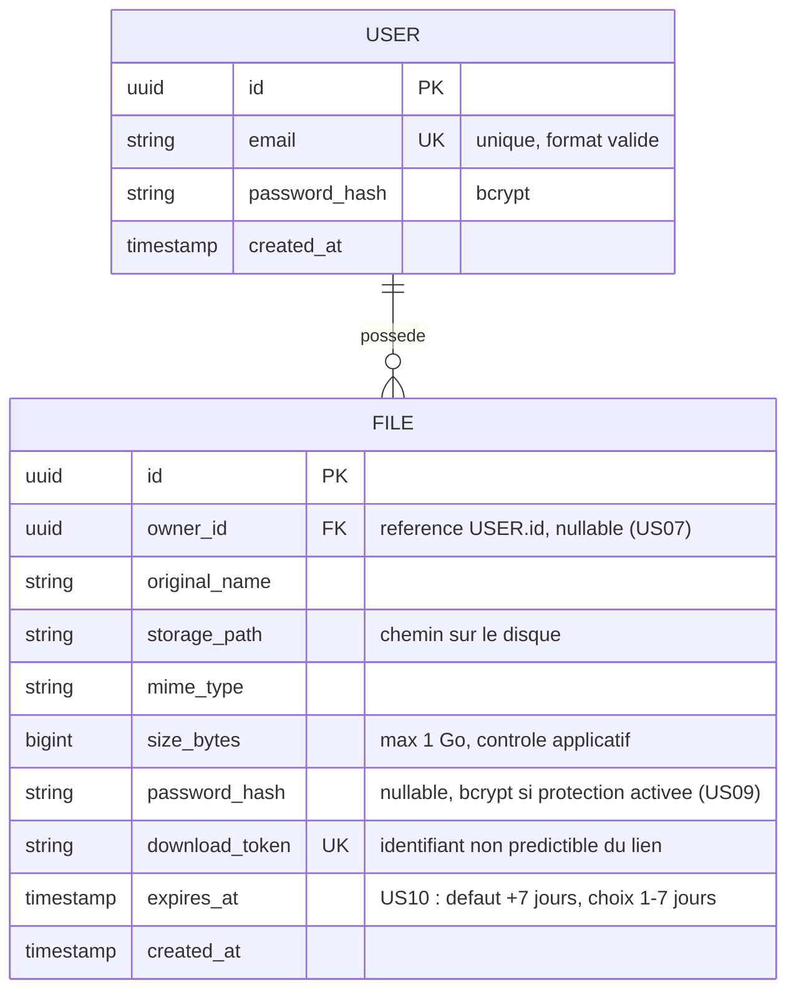

# Modèle de données

Périmètre couvert : le MVP (US01 à US06) et les fonctionnalités avancées optionnelles réalisées (US07 upload anonyme, US09 mot de passe fichier, durée d'expiration d'US10). Le modèle décrit la base telle qu'elle existe (`back/prisma/schema.prisma`) ; ce qui était prévu pour les fonctionnalités non réalisées (US08 gestion des tags, purge quotidienne d'US10) est résumé en fin de document.

## MCD (notation Merise / entité-association)

## Règles de gestion associées

- **USER.email** : unique en base (contrainte `UNIQUE`), validé côté applicatif (format) avant insertion.
- **USER.password_hash** : jamais stocké en clair ; hash bcrypt avec salage automatique.
- **FILE.owner_id** : `NULLABLE`. Renseigné pour un upload avec compte (US01, historique disponible) ; `NULL` pour un upload anonyme (US07 — le fichier n'apparaît alors dans aucun historique). Suppression en cascade (`ON DELETE CASCADE`) si le compte propriétaire est supprimé.
- **FILE.download_token** : généré côté serveur (UUID v4), unique, sert de clé publique dans l'URL de téléchargement (`/f/{download_token}`) — jamais l'identifiant technique `id`.
- **FILE.password_hash** : `NULL` si le fichier n'est pas protégé ; sinon hash bcrypt du mot de passe saisi à l'upload (US01/US09, minimum 6 caractères contrôlé côté client et serveur). Disponible aussi bien en upload authentifié qu'anonyme.
- **FILE.expires_at** : calculé à l'upload (`created_at` + durée choisie, 1 à 7 jours, 7 par défaut — US10) ; contrôlé côté serveur (impossible de dépasser 7 jours). Le téléchargement est refusé dès que `expires_at` est dépassé, par un contrôle applicatif. Le fichier apparaît alors comme « expiré » dans l'historique et reste stocké tant que son propriétaire ne le supprime pas : la purge quotidienne d'US10 n'est pas réalisée (cf. note « cycle de vie d'un fichier expiré » de `docs/architecture.md`).
- **Suppression** : la suppression par le propriétaire (US06) est physique et irréversible — elle retire l'enregistrement `FILE` **et** le fichier binaire sur le disque.

## Index et contraintes techniques

| Table | Colonne(s) | Type d'index | Raison |
|---|---|---|---|
| user | email | UNIQUE | contrainte métier + recherche rapide à la connexion |
| file | download_token | UNIQUE | résolution du lien de téléchargement en O(1) |
| file | owner_id | INDEX | listing rapide de l'historique d'un utilisateur (US05), nullable pour US07 |
| file | expires_at | INDEX | filtre « actifs / expirés » de l'historique (US05, US06) ; servirait aussi à la purge des fichiers expirés (US10, non réalisée) |

## Fonctionnalités non réalisées

Deux fonctionnalités avancées, optionnelles dans les spécifications, n'ont pas été développées. Le modèle avait été conçu pour les accueillir :

- **Tags (US08)** : une entité `TAG` (`id`, `file_id`, `value` de 30 caractères au plus) liée à `FILE` par une relation 1-N, avec une contrainte d'unicité `(file_id, value)` contre les doublons et une suppression en cascade avec le fichier. Elle demanderait sa propre migration.
- **Purge quotidienne (US10)** : une tâche planifiée supprimerait les fichiers dont `expires_at` est dépassé, en base et sur le disque. Aucune évolution du modèle n'est nécessaire : l'index sur `expires_at` existe déjà.
