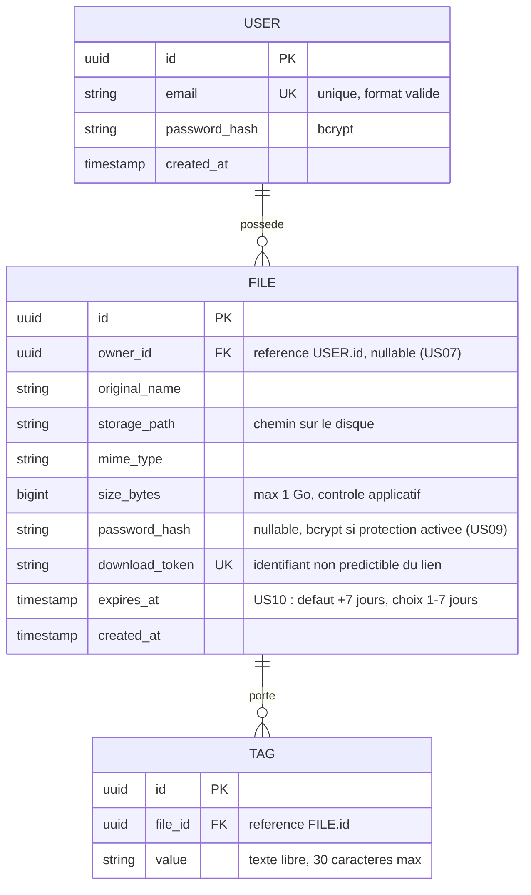

# Modèle de données

Périmètre couvert : le MVP (US01 à US06) et l'ensemble des fonctionnalités avancées optionnelles (US07 upload anonyme, US08 gestion des tags, US09 mot de passe fichier, US10 expiration automatique), implémentées en plus du MVP.

## MCD (notation Merise / entité-association)

## Règles de gestion associées

- **USER.email** : unique en base (contrainte `UNIQUE`), validé côté applicatif (format) avant insertion.
- **USER.password_hash** : jamais stocké en clair ; hash bcrypt avec salage automatique.
- **FILE.owner_id** : `NULLABLE`. Renseigné pour un upload avec compte (US01, historique disponible) ; `NULL` pour un upload anonyme (US07 — le fichier n'apparaît alors dans aucun historique). Suppression en cascade (`ON DELETE CASCADE`) si le compte propriétaire est supprimé.
- **FILE.download_token** : généré côté serveur (UUID v4), unique, sert de clé publique dans l'URL de téléchargement (`/f/{download_token}`) — jamais l'identifiant technique `id`.
- **FILE.password_hash** : `NULL` si le fichier n'est pas protégé ; sinon hash bcrypt du mot de passe saisi à l'upload (US01/US09, minimum 6 caractères contrôlé côté client et serveur). Disponible aussi bien en upload authentifié qu'anonyme.
- **FILE.expires_at** : calculé à l'upload (`created_at` + durée choisie, 1 à 7 jours, 7 par défaut — US10) ; contrôlé côté serveur (impossible de dépasser 7 jours). Le téléchargement est refusé dès que `expires_at` est dépassé, sans attendre la purge ; une tâche planifiée quotidienne supprime ensuite les fichiers expirés (métadonnées **et** binaire). Entre ces deux instants, le fichier apparaît comme « expiré » dans l'historique (cf. note « cycle de vie d'un fichier expiré » de `docs/architecture.md`).
- **TAG.value** : texte libre (US08), longueur maximale 30 caractères, associé à un unique fichier (pas de table de référence partagée entre fichiers/utilisateurs, chaque tag est propre au fichier sur lequel il est posé).
- **TAG** : contrainte d'unicité composite `(file_id, value)` pour interdire les doublons de tag sur un même fichier. Fonctionnalité réservée aux fichiers uploadés par un utilisateur connecté (donc uniquement si `FILE.owner_id` est renseigné).
- **Suppression** : qu'elle soit manuelle (US06) ou automatique via la tâche planifiée (fichier expiré), la suppression est physique et irréversible — elle retire l'enregistrement `FILE`, ses éventuels `TAG` associés (`ON DELETE CASCADE`), **et** le fichier binaire sur le disque.

## Index et contraintes techniques

| Table | Colonne(s) | Type d'index | Raison |
|---|---|---|---|
| user | email | UNIQUE | contrainte métier + recherche rapide à la connexion |
| file | download_token | UNIQUE | résolution du lien de téléchargement en O(1) |
| file | owner_id | INDEX | listing rapide de l'historique d'un utilisateur (US05), nullable pour US07 |
| file | expires_at | INDEX | requête quotidienne de purge des fichiers expirés (US10) |
| tag | (file_id, value) | UNIQUE composite | interdit les doublons de tag sur un même fichier (US08) |
